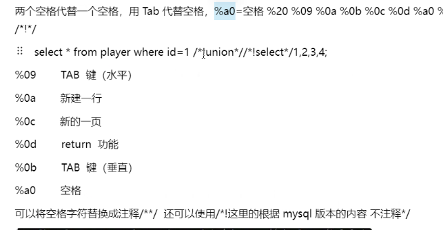

# 笔记

# 空格过滤:
/**/,%0a,双空格(替换字符串时),()括号语法

like 匹配  select user() like 'ro%'
COUNT(*) 函数用于计算表中的行数
mysql_real_escape_string():%df或utf-6编码

select * from player where id=1 union select * from ((select 1)A join (select 2)B join (select 3)C join (select 4)D);