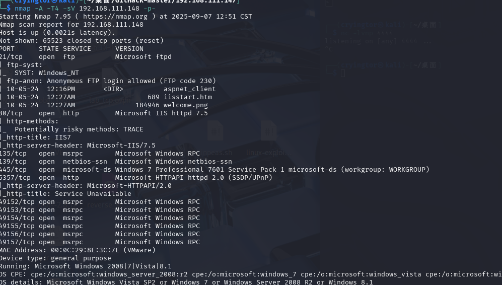
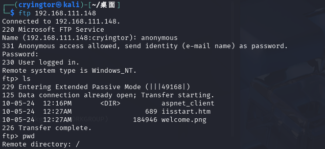
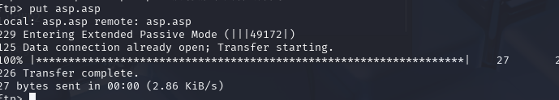
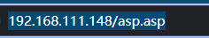
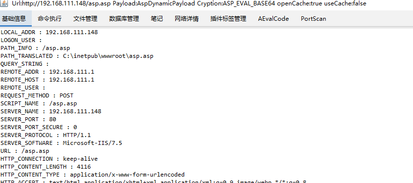
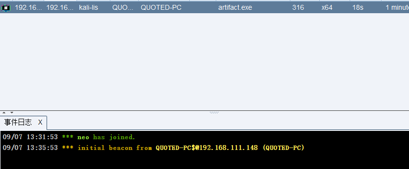
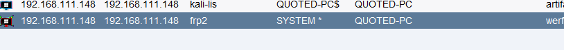
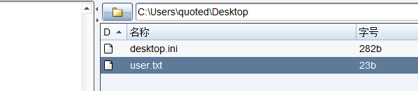
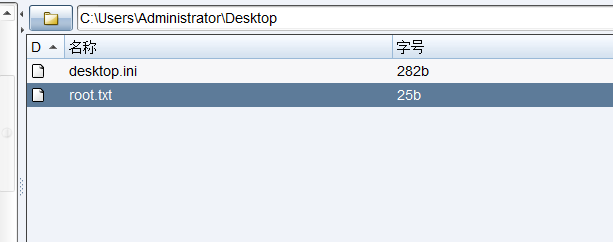

# qouted
nmap扫描

存在ftp匿名登陆,好像是web的文件

web是一个iis的页面,通过ftp尝试上传asp后门

确保能够访问

使用哥斯拉成功连接

上线CS

使用sweetpotato提权

在quoted用户desktop下找到uesrflag

HMV{User_Flag_Obtained}
在administrator用户desktop下找到flag

HMV{Elevated_Shell_Again}

看一下其他思路;
1.dll劫持
2.juicypotato
3.msf本地漏洞探测

