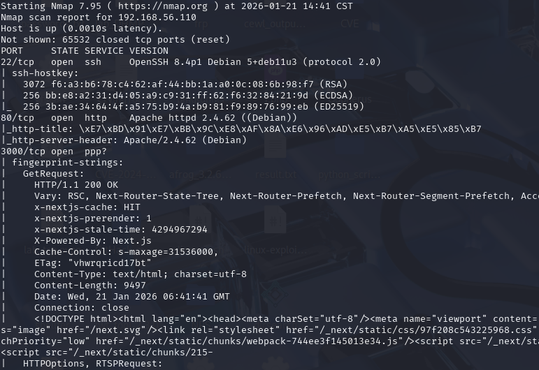
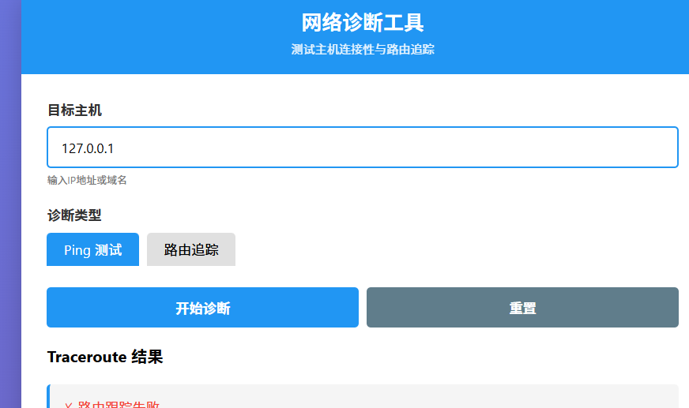
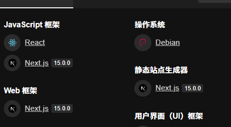
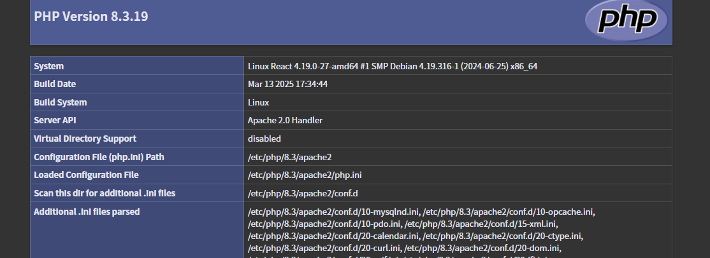
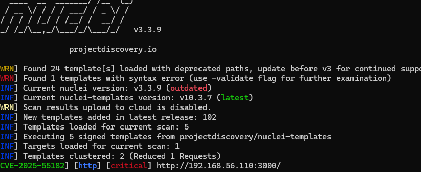
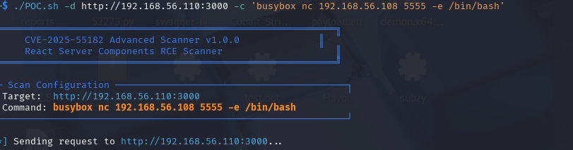
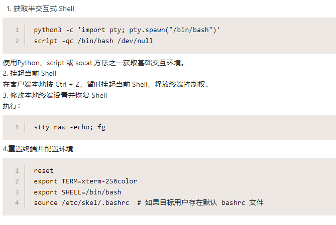
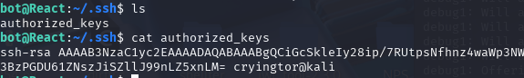
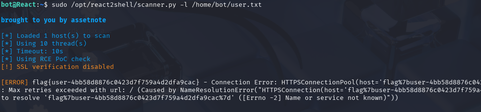

# react
起手nmap

80端口是一个网络诊断

3000端口是react框架

进行一下目录扫描
只扫出一个phpinfo页面

试一下前段时间爆出的react的rce漏洞

确实存在
找个可以利用的poc
https://github.com/zack0x01/CVE-2025-55182-advanced-scanner-/blob/main/scanner.sh
随后用nc弹回shell

先升级一下shell的交互

在用户目录下找到flag

提权root:
查看可以使用的特权命令

scanner.py也是一个react的poc脚本,尝试以root身份运行
这里直接使用sudo /opt/react2shell/scanner.py命令
但是这里无论干什么都无法扫描出漏洞,刷新web页面也一直卡住,一直超时
看了下方法通过写公钥解决

使用命令sudo /opt/react2shell/scanner.py -l /root/root.txt会从中读取列表,但是会将文件中的内容报错显示出来,导致了一个特权文件披露漏洞(root.txt被我搞没了用user.txt示例)

