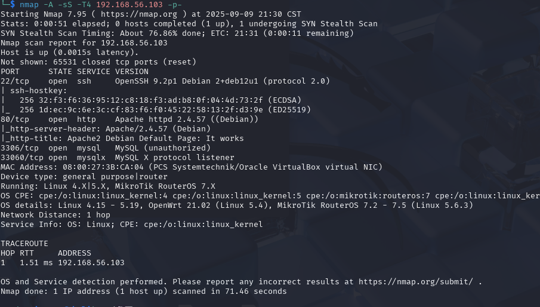
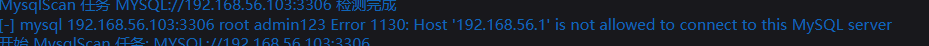
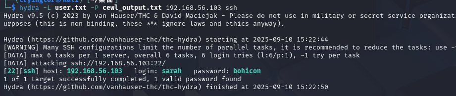
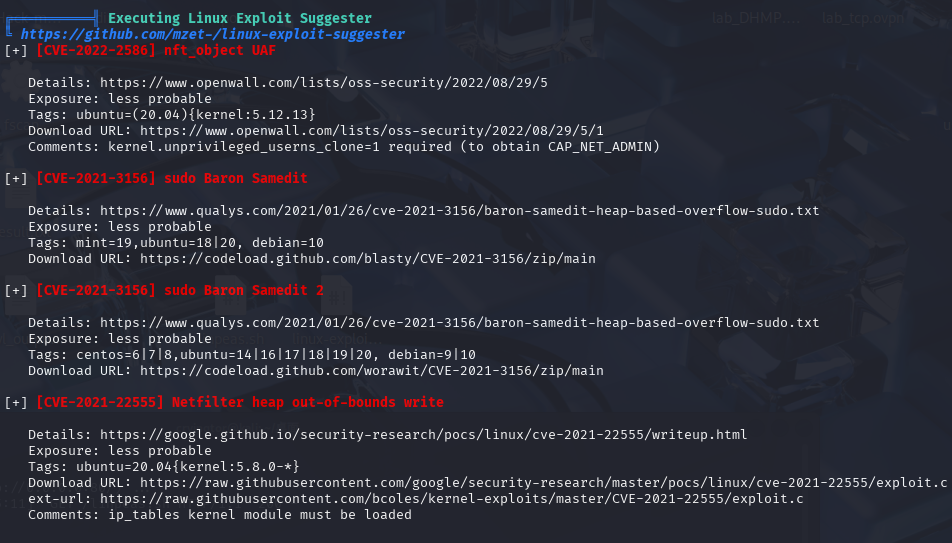

# vivifytech
nmap扫描

80端口是apache页面
先尝试mysql能否连接和弱口令登录

不支持外联
80端口目录扫描发现wordpress站点
查看登录接口
用wpscan没扫出来用户
翻看一下文章得到账户sancelisso,Emily,Mark,Jake,Alex,Sarah
```
cewl http://192.168.56.103/wordpress -w cewl_output.txt
```
用cewl爬取一下网页后用wpscan爆破一下
```
wpscan --url http://192.168.56.103/wordpress/wp-login.php -U user.txt -P cewl_output.txt
```
没成功
爆破一下ssh
```
hydra -L user.txt -P cewl_output.txt ssh://192.168.56.103
```
还是不行
看了下http://192.168.56.103/wordpress/wp-includes/secrets.txt里面存放密码拿去再跑一边

读取到user.txt
接下来尝试提权
sudo和suid提权都没甚么能利用的
想到还有mysql服务,可以尝试一下
root/root直接进了
想过udf提权,但是没有权限写文件


直接放lineas.sh跑一下



