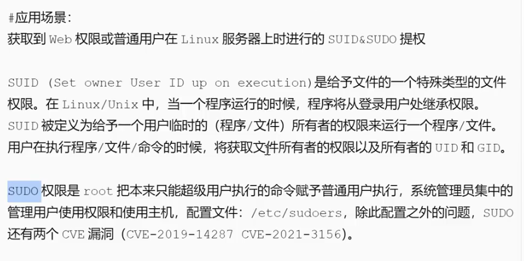

# suid&sudo

<mark>大致意思是:用赋予suid或sudo的程序,执行命令,可以用脚本LinEnum.sh辅助查找能够利用的有权限的程序,这些程序被管理员设置以最高权限执行</mark>

sudo find 和 find是会有不同的结果
配置文件:/etc/sudoers

执行/user/bin/awk时则不需要密码,直接以sudo执行

sudo漏洞:
CVE-2021-3156(需普通用户)
CVE-2019-14287
CVE-2023-22809