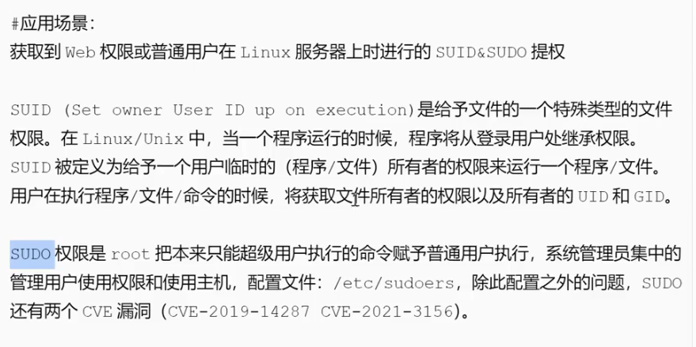
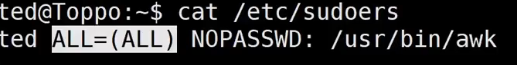

# suid&sudo


<mark>大致意思是:用赋予suid或sudo的程序,执行命令,可以用脚本LinEnum.sh辅助查找能够利用的有权限的程序,这些程序被管理员设置以最高权限执行</mark>

```

# 基本查找（快速扫描）
find / -perm -4000 -type f -exec ls -ld {} \; 2>/dev/null

# 高级查找（包含上下文信息）
find / -type f $ -perm -4000 -o -perm -2000 $ -exec ls -l {} \; 2>/dev/null \
| awk '{print $1,$3,$4,$9}'

```

sudo find 和 find是会有不同的结果
配置文件:/etc/sudoers

执行/user/bin/awk时则不需要密码,直接以sudo执行

sudo命令漏洞:
CVE-2021-3156(需普通用户)
CVE-2019-14287
CVE-2023-22809
CVE-2025-32463
