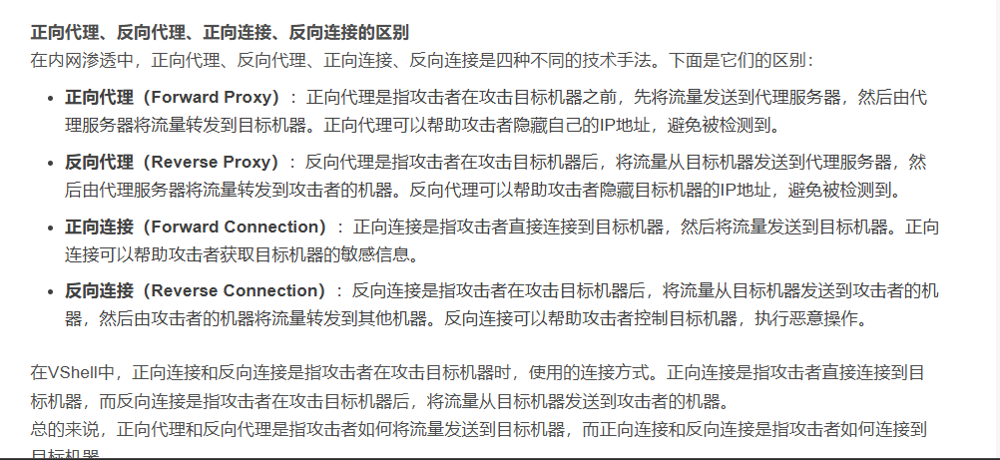

# 代理


解决网络通讯不可达,进行信息收集
()如果拿下一台主机就把工具等等传到被控主机上，会产生很多不必要的问题)
通常通过proxyfiler进行流量代理

reverse反向
bind 正向
选择基于目标防火墙规则,通常出站宽松,用反向较多
每当拿下一个服务器,在CS上开启socks服务,通过proxy软件连接CS服务器相应端口
CS:右键开启代理转发


msf:
```
run autoroute -p#查看路由表

run post/multi/manage/autoroute#添加路由

生成后门(正向),以跳板机去连接

将跳板机对话切换至后台,连接目标机

开启socks代理(目的是为了不仅仅让msf通讯,便于使用其他软件通讯)
use auxiliary/server/socks_proxy
将在本机开启代理端口
```