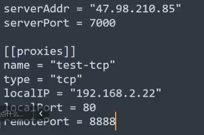

# frp使用

服务端在47.....上开启
配置文件:


C2上线:

```
监听器1:47...... 6666 端口(后门)
监听器2:192......(CS服务端也为frp客户端) 5555 端口
生成后门用监听器1:目标机后门将流量发向外网服务器的6666端口,通过frp映射到本地的5555端口上线

```

信息收集:
```
1.建立socks节点(CS无法上线)
目标机:(客户端)
出站无限制
连接47..... 7000
让远程服务端的6000端口作为访问目标机的socks代理
kali访问公网:6000作为代理
```


2.端口映射转发

```
目标机:(客户端)
连接47....... 7000服务端
将服务端(公网)的8888转发到2.22 80端口
kali访问公网:8888
2.22为目标机另一个网卡
```


