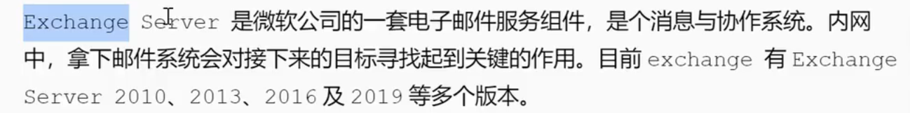

# EXchange电子邮件服务

攻击方式:
漏洞利用
钓鱼
暴力破解

---
信息收集:
端口扫描,25/587/2525,则可能开启exchange服务
spn探测:powershell setspn -T 0day.org -q */*
,脚本探针Exchange_GetVersion_MatchVul.py

---

无凭证:
1.采用爆破手段
2.漏洞利用
proxylogon,Proxyshell攻击链对Exchange实施攻击,能拿到Exchang的system权限

有凭证:
CVE-2020-17144
