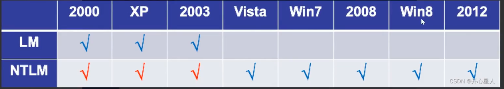

# PTH(hashi传递)

LM-HASH,NTML-HASH

**1.直接利用hash攻击**
miniktz抓取后
smb
wmic
impaket
psexec

---

**2.利用hash转为ptt攻击**
见PTT第二种

---

**3.利用hash进行暴力破解明文**

hashcat
1.字典破解
准备字典
```
hashcat.exe -a 0 -m 1000 hash.txt pass.txt
```

2.暴力破解
```
hashcat.exe -a 3 -m 1000 (hash) ?l?l?l.................
```
-m 密文类型
-a 破解类型
?d 数字
?l 小写
?u 大写

---
**4.修改注册表重启进行明文获取**

