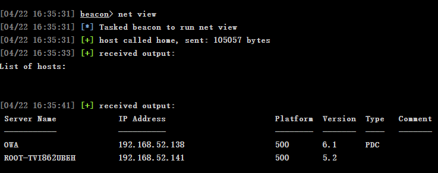
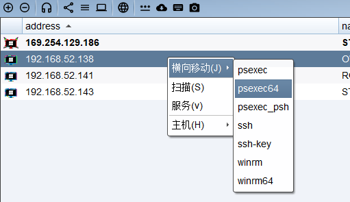
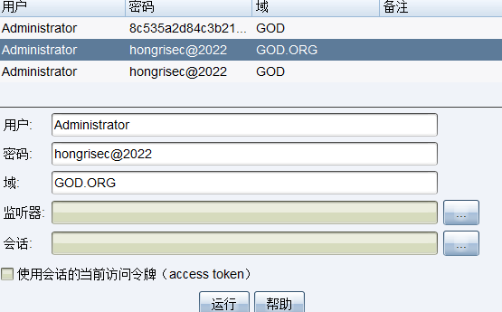
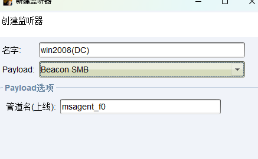
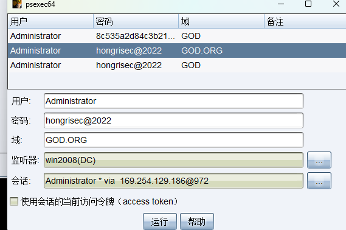
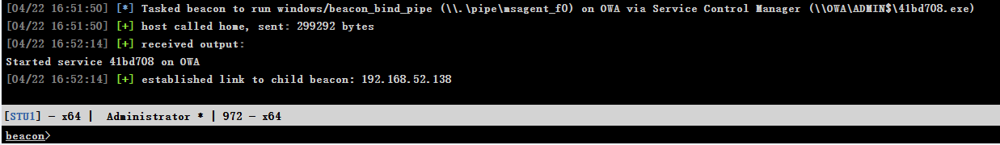
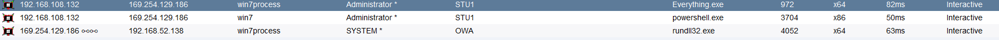
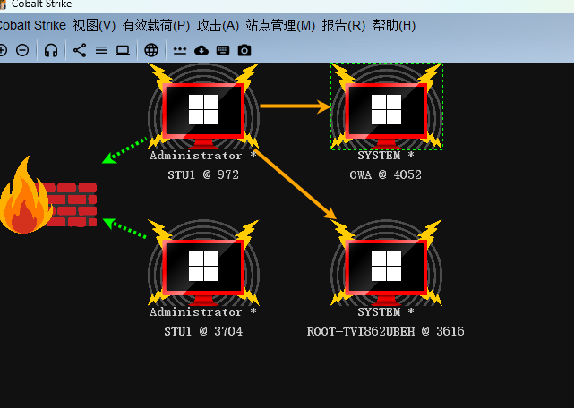

# 横向移动
查看域用户信息
net view

PDC则为域控制器DC
接下来将借助口令复用,进行横向
使用PsExec(一个与talent相同功能,实现交互)建立IPC通道,上线DC
右键选择要连接的主机,选择64SD位

选择刚才提取的账号密码作凭证,并创建一个smb协议的监听器,并选择win7的会话(64位的shell)

出现以下,代表成功

会话中将多出一个内网ip为win2008的ip的会话,且为system权限
同理可以对另一win2003进行控制(注意:win2003是32位的系统,选择32位的psexec)

最终看到网络的拓扑图

