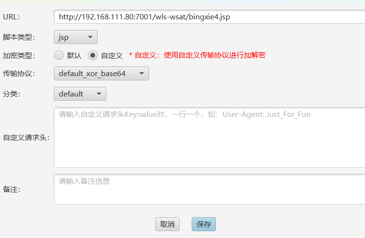

# 上传冰蝎shell
生成冰蝎马,放在可访问目录wls-wsat/下
绝对路径为:
```
C:\Oracle\Middleware\user_projects\domains\base_domain\servers\AdminServer\tmp\_WL_internal\wls-wsat\54p17w\war\bingxie4.jsp
```
上传后访问

成功,使用冰蝎连接失败

发现连接不了,改用哥斯拉

连接成功

成功拿到shell,哥斯拉支持一键上msf
接下来可以尝试上线CS,但是360会检测,需要免杀插件:powershell_bypass.cna
地址:[bypassAvv](https://github.com/Mespoding/bypassAvv)
导入到CS中,然后先生成paylaod

再将生成的bin文件用插件做免杀,点击powershell免杀