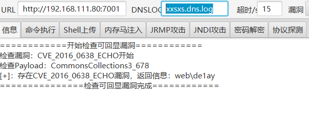
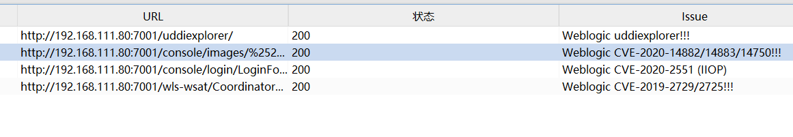
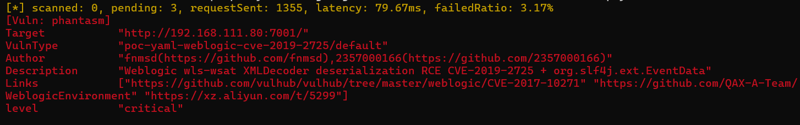
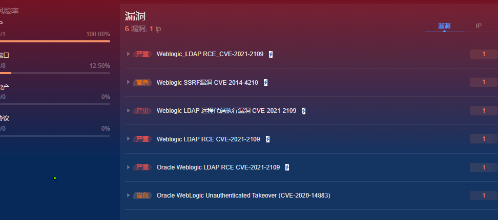
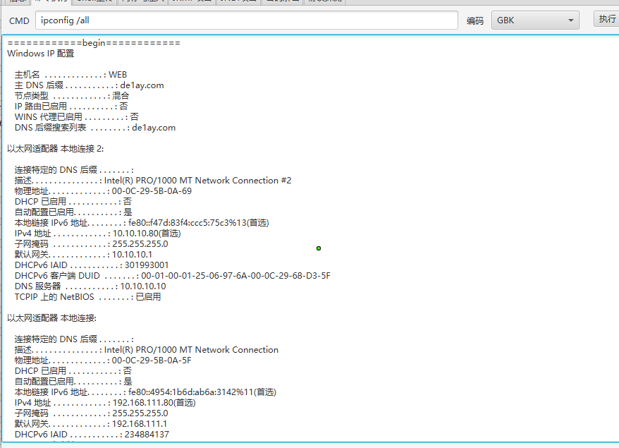
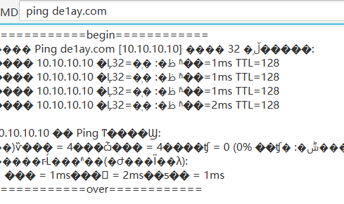

# 外网渗透
浏览器中访问WEB机,发现是空白,那么直接用nmap扫描
结果:
```
Starting Nmap 7.95 ( https://nmap.org ) at 2025-04-25 13:53 中国标准时间
NSE: Loaded 157 scripts for scanning.
NSE: Script Pre-scanning.
Initiating NSE at 13:53
Completed NSE at 13:53, 0.00s elapsed
Initiating NSE at 13:53
Completed NSE at 13:53, 0.00s elapsed
Initiating NSE at 13:53
Completed NSE at 13:53, 0.00s elapsed
Initiating ARP Ping Scan at 13:53
Scanning 192.168.111.80 [1 port]
Completed ARP Ping Scan at 13:53, 0.06s elapsed (1 total hosts)
Initiating Parallel DNS resolution of 1 host. at 13:53
Completed Parallel DNS resolution of 1 host. at 13:53, 0.29s elapsed
Initiating SYN Stealth Scan at 13:53
Scanning 192.168.111.80 [1000 ports]
Discovered open port 135/tcp on 192.168.111.80
Discovered open port 139/tcp on 192.168.111.80
Discovered open port 80/tcp on 192.168.111.80
Discovered open port 3389/tcp on 192.168.111.80
Discovered open port 445/tcp on 192.168.111.80
Discovered open port 49153/tcp on 192.168.111.80
Discovered open port 49154/tcp on 192.168.111.80
Discovered open port 7001/tcp on 192.168.111.80
Discovered open port 49152/tcp on 192.168.111.80
Completed SYN Stealth Scan at 13:53, 5.20s elapsed (1000 total ports)
Initiating Service scan at 13:53
Scanning 9 services on 192.168.111.80
Completed Service scan at 13:54, 58.67s elapsed (9 services on 1 host)
Initiating OS detection (try #1) against 192.168.111.80
Retrying OS detection (try #2) against 192.168.111.80
NSE: Script scanning 192.168.111.80.
Initiating NSE at 13:54
Completed NSE at 13:54, 40.15s elapsed
Initiating NSE at 13:54
Completed NSE at 13:54, 0.08s elapsed
Initiating NSE at 13:54
Completed NSE at 13:54, 0.00s elapsed
Nmap scan report for 192.168.111.80
Host is up (0.0012s latency).
Not shown: 991 filtered tcp ports (no-response)
PORT      STATE SERVICE       VERSION
80/tcp    open  http          Microsoft IIS httpd 7.5
|_http-title: Site doesn't have a title.
|_http-server-header: Microsoft-IIS/7.5
| http-methods: 
|   Supported Methods: OPTIONS TRACE GET HEAD POST
|_  Potentially risky methods: TRACE
135/tcp   open  msrpc         Microsoft Windows RPC
139/tcp   open  netbios-ssn   Microsoft Windows netbios-ssn
445/tcp   open  microsoft-ds  Windows Server 2008 R2 Standard 7601 Service Pack 1 microsoft-ds
3389/tcp  open  ms-wbt-server Microsoft Terminal Service
| rdp-ntlm-info: 
|   Target_Name: DE1AY
|   NetBIOS_Domain_Name: DE1AY
|   NetBIOS_Computer_Name: WEB
|   DNS_Domain_Name: de1ay.com
|   DNS_Computer_Name: WEB.de1ay.com
|   DNS_Tree_Name: de1ay.com
|   Product_Version: 6.1.7601
|_  System_Time: 2025-04-25T05:54:12+00:00
| ssl-cert: Subject: commonName=WEB.de1ay.com
| Issuer: commonName=WEB.de1ay.com
| Public Key type: rsa
| Public Key bits: 2048
| Signature Algorithm: sha1WithRSAEncryption
| Not valid before: 2025-04-24T04:23:43
| Not valid after:  2025-10-24T04:23:43
| MD5:   077a:3f03:eb7b:efc8:9453:e16c:8856:5f91
|_SHA-1: 3f47:39fc:a190:c1fa:24dd:d50a:e0b7:b6eb:93a9:de47
|_ssl-date: 2025-04-25T05:54:52+00:00; 0s from scanner time.
7001/tcp  open  http          Oracle WebLogic Server 10.3.6.0 (Servlet 2.5; JSP 2.1; T3 enabled)
|_http-title: Error 404--Not Found
|_weblogic-t3-info: T3 protocol in use (WebLogic version: 10.3.6.0)
49152/tcp open  msrpc         Microsoft Windows RPC
49153/tcp open  msrpc         Microsoft Windows RPC
49154/tcp open  msrpc         Microsoft Windows RPC
MAC Address: 00:0C:29:5B:0A:5F (VMware)
Warning: OSScan results may be unreliable because we could not find at least 1 open and 1 closed port
Device type: general purpose|phone|specialized
Running (JUST GUESSING): Microsoft Windows 8.1|7|2008|Phone|Vista (94%)
OS CPE: cpe:/o:microsoft:windows_8.1:r1 cpe:/o:microsoft:windows_7 cpe:/o:microsoft:windows_server_2008:r2 cpe:/o:microsoft:windows cpe:/o:microsoft:windows_8 cpe:/o:microsoft:windows_vista::- cpe:/o:microsoft:windows_vista::sp1
Aggressive OS guesses: Microsoft Windows 8.1 R1 (94%), Microsoft Windows 7 (92%), Microsoft Windows Server 2008 R2 or Windows 7 SP1 (92%), Microsoft Windows Phone 7.5 or 8.0 (92%), Microsoft Windows Embedded Standard 7 (92%), Microsoft Windows 7 or Windows Server 2008 R2 (90%), Microsoft Windows 7 Professional or Windows 8 (90%), Microsoft Windows Vista SP0 or SP1, Windows Server 2008 SP1, or Windows 7 (90%), Microsoft Windows Vista SP2, Windows 7 SP1, or Windows Server 2008 (90%), Microsoft Windows Server 2008 or 2008 Beta 3 (89%)
No exact OS matches for host (test conditions non-ideal).
Uptime guess: 0.046 days (since Fri Apr 25 12:49:14 2025)
Network Distance: 1 hop
TCP Sequence Prediction: Difficulty=253 (Good luck!)
IP ID Sequence Generation: Incremental
Service Info: OSs: Windows, Windows Server 2008 R2 - 2012; CPE: cpe:/o:microsoft:windows

Host script results:
|_clock-skew: mean: -1h36m00s, deviation: 3h34m39s, median: 0s
| smb-security-mode: 
|   account_used: <blank>
|   authentication_level: user
|   challenge_response: supported
|_  message_signing: disabled (dangerous, but default)
| smb-os-discovery: 
|   OS: Windows Server 2008 R2 Standard 7601 Service Pack 1 (Windows Server 2008 R2 Standard 6.1)
|   OS CPE: cpe:/o:microsoft:windows_server_2008::sp1
|   Computer name: WEB
|   NetBIOS computer name: WEB\x00
|   Domain name: de1ay.com
|   Forest name: de1ay.com
|   FQDN: WEB.de1ay.com
|_  System time: 2025-04-25T13:54:13+08:00
| smb2-security-mode: 
|   2:1:0: 
|_    Message signing enabled but not required
| smb2-time: 
|   date: 2025-04-25T05:54:14
|_  start_date: 2025-04-25T04:50:00

TRACEROUTE
HOP RTT     ADDRESS
1   1.16 ms 192.168.111.80

NSE: Script Post-scanning.
Initiating NSE at 13:54
Completed NSE at 13:54, 0.00s elapsed
Initiating NSE at 13:54
Completed NSE at 13:54, 0.00s elapsed
Initiating NSE at 13:54
Completed NSE at 13:54, 0.00s elapsed
Read data files from: D:\Pentest_tools\Nmap
OS and Service detection performed. Please report any incorrect results at https://nmap.org/submit/ .
Nmap done: 1 IP address (1 host up) scanned in 109.76 seconds
           Raw packets sent: 2079 (96.596KB) | Rcvd: 39 (1.992KB)

```
开放了weblogic服务,版本号为WebLogic version: 10.3.6.0
使用weblogic工具,weblogictool

这里学习使用BP+xray,和用BP的TsojanScan插件检测

扫出来2019的RCE漏洞

goby扫描

这里方便就用工具的洞(编码可以选则gbk,就不会出现脏数据)

发现是在de1ay域中
ping域,查看域控ip:10.10.10.10

检测是否有杀软tasklist /svc

有360杀毒软件
工具上不便于控制,想方法上传shell(需做免杀)