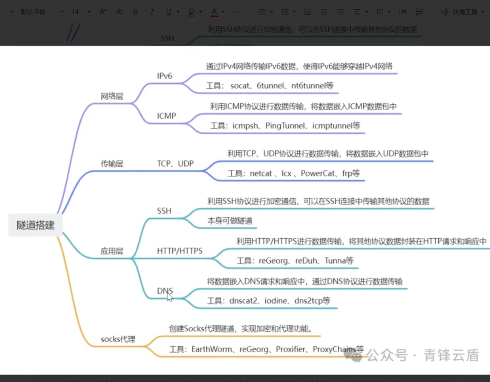
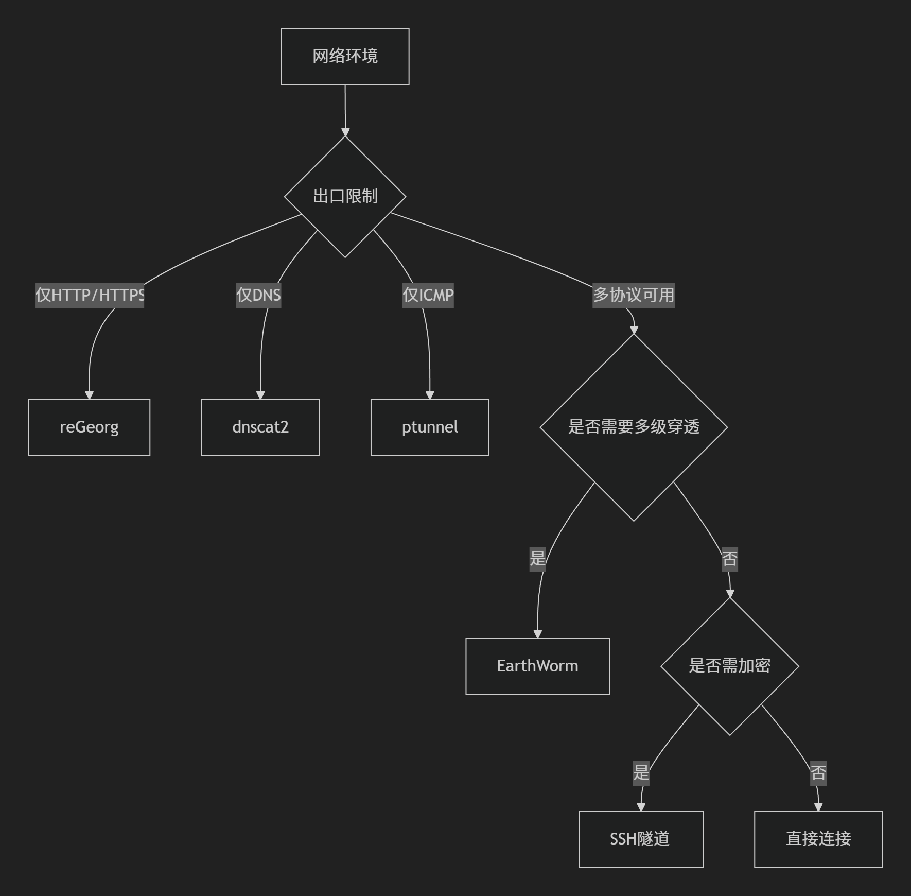

# 认识
前置:
* c2协议理解
* 目的:控制目标,信息收集
* 判断出网协议
ICMP----ping
HTTP----curl
SSH-----ssh
DNS-----nslookup
TCP-----telent


```
​核心目的：绕过网络限制​
主要用于突破防火墙规则，让受限的网络流量能够通过唯一的可用出口通道进行传输。
解决核心问题是：​​“此路不通，如何另辟蹊径？”​。例如，目标机器只能访问80端口(HTTP)，你想通过它访问其内网数据库(通常是其他端口)，或者将远程桌面(RDP)流量伪装成HTTP。

​工作原理：协议封装​
​隧道化/封装:​​ 将一种网络协议的流量封装在另一种允许通过防火墙的协议内部进行传输。
​终端解封:​​ 在隧道的另一端（攻击者的服务器或跳板机），被封装的原始协议流量会被解封出来，恢复原状并转发到最终目的地。

​对应用透明:​​ 在隧道两端运行的应用程序（如你的攻击工具或内网服务）通常不知道数据包已被封装/解封。它们就像在直接通信一样。

​关键特点：​​
​建立隐秘通道:​​ 在受限网络之间（如：受控内网主机 ↔ 攻击者服务器）建立隐藏的通信管道。
​协议伪装:​​ 将高风险的流量（如RDP, SMB, SSH）伪装成低风险的协议（如HTTP, HTTPS, DNS, ICMP）以规避检测。

​端口复用:​​ 通过单一开放端口传输多种服务的流量。
​加密传输:​​ 许多隧道工具内置加密（如SSH隧道、SSL/TLS隧道），增强隐蔽性。
​隧道入口在目标:​​ 需要在目标受限环境内部署隧道客户端或利用现有工具建立隧道出口。
```

网络层:
    ipv隧道:利用ipv6协议封装opv4流量
    icmp隧道:通过icmp协议传输数据
传输层:
    TCP隧道:基于TCP协议封装流量
    UDP隧道:基于UDP协议封装流量
    常规端口转发:将流量重定向至允许端口
应用层:
    SSH隧道:通过SSH协议封装流量
    HTTP/S隧道:利用HTTP/HTTPS协议隐藏通信
    DNS隧道:通过DNS查询传输数据
    

socks代理:
    
aaaaaaaaaaaaaaaaaaaaaaaaaaaaaaaaaaaaaaaaaaaaaaaaaaaaaaaaaaaaaaaaaaaaaaaaaaaaaaaaaaaaaaaaaaaaaaaaaaaaaaaaaaaaaaaaaaaaaaaaaaaaaaaaaaaaaaaaaaaaaaaaaaaaaaaaaaaaaaaaaaaaaaaaaaaaaaaaaaaaaaaaaaaaaaaaaaaaaaaaaaaaaaaaaaaaaaaaaaaaaaaaaaaaaaaaaaaaaaaaaaaaaaaaaaaa
